# AI Tester Blueprint 3.x

A practical, project-driven curriculum for QA engineers learning to use LLMs as a real testing tool — not a toy.
Each chapter pairs concept material with a hands-on project, a prompt template, and runnable code where applicable.

- **Author:** Pramod Dutta — Principal SDET
- **Website:** [The Testing Academy](https://thetestingacademy.com/)
- **LinkedIn:** [linkedin.com/in/pramoddutta](https://www.linkedin.com/in/pramoddutta/)

---

## Curriculum Map

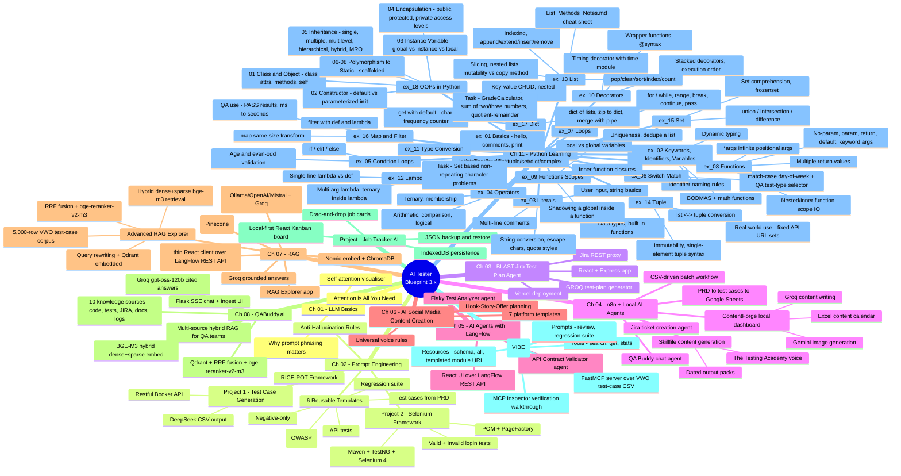

---

## Repository Layout

```
.
├── chapter_01_LLM_Basics/         How transformers and attention work
│   ├── attention_interactive.html
│   ├── attention_is_all_you_need.html
│   └── Notes.md
│
├── chapter_02_Prompt_Eng/         Prompt engineering for QA work
│   ├── Anti_Hallucinations_Rules.md
│   ├── Project1_TC_Gen/           Test case generation from a PRD/API doc
│   │   ├── RICE-POT-TestCase-Prompt.md
│   │   ├── RICE_POT_FRAMEWORK/
│   │   ├── Restful-booker.pdf
│   │   ├── Restful_Booker_API_Test_Cases.md
│   │   └── output/
│   ├── Project2_Selenium_Framework/   POM-based Selenium framework built from a prompt
│   │   ├── Problem.md
│   │   ├── SKILL.md                   RICE-POT prompt-builder skill
│   │   ├── blank-template-rice-pot.md
│   │   └── AdvanceSeleniumFramework/  Maven + TestNG + Selenium 4
│   └── templates/                 Reusable prompt templates (RTCFR / RICE-POT)
│       ├── 01_TestCaseGeneration_Prompt.md
│       ├── 02_TestCases_from_prd
│       ├── 03_API_Test_Generation.md
│       ├── 04_Negative_TC_Only.md
│       ├── 05_Secuirty_Test.md
│       └── 06_Regression_Suite.md
│
├── chapter_03_BLAST_FW_JIRA_AI_AGENT/   Jira to test-plan generator
│   ├── README.md
│   ├── B.L.A.S.T.md
│   ├── architecture/              Layer 1 SOPs and test-plan template
│   ├── api/                       Vercel serverless endpoints
│   ├── src/                       React UI
│   ├── tools/                     Jira, GROQ, and Markdown engines
│   ├── server.js                  Local Express proxy
│   └── package.json
│
├── chapter_04_AI_Agents_n8n/      n8n workflows + local AI agent projects
│   ├── README.md
│   ├── n8n_AIAgent/
│   │   ├── AI_3X_01_QA_Buddy.json
│   │   ├── AI_3X_02_JIRA_Agent.json
│   │   ├── AI_3X_03_Read_PRD_TestCases_Excel.json
│   │   └── AI_3X_04_Read_PRD_TestCases_Excel_v2.json
│   ├── social_ai_agent/
│   │   └── contentforge/          Next.js local content pipeline dashboard
│   └── skillfile_content_generation/
│       ├── SKILL.md               The Testing Academy content engine
│       └── output/                Dated publish-ready content packs
│
├── chapter_05_AI_Agents_LangFlow/  LangFlow-built QA agents
│   ├── README.md
│   ├── LangFlow vs LangGraph vs LangSmith.md
│   ├── Project/                   Importable LangFlow flow JSONs
│   └── flaky_test_analyzer_ai_Agent/
│       ├── result1.json / result2.json   Sample Playwright run pairs
│       └── ui/                    React UI proxied to LangFlow (:7861)
│
├── chapter_06_AI_Social_Media_Content_Creation/  Repurpose one idea across 7 platforms
│   ├── README.md
│   ├── 00_Hook_Story_Offer_Planning.md   Plan once — source of truth
│   └── 01..07_*.md                Per-platform templates (YouTube, IG, Medium, Blog, LinkedIn…)
│
├── chapter_07_RAG/                Retrieval-Augmented Generation demo
│   ├── README.md
│   ├── RAG_Explorer.jpg
│   ├── Basic_RAG_n8n.jpg
│   ├── Langflow_RAG.jpg                          LangFlow canvas — Ollama-embeddings iteration
│   ├── Langflow-Task-Testcases-Mistral-Groq.png  LangFlow canvas — final Mistral+Groq flow
│   ├── Langflow-Task-Testcases-Mistral-Groq-Results.png     LangFlow Playground — 3 demo Q&As
│   ├── Langflow-Task-Testcases-Mistral-Groq-UI-Results.png  rag-explorer chat UI — same Q&As
│   ├── Advanced-RAG-Pipeline.png                 Advanced RAG — hybrid ingest/chat pipeline diagram
│   ├── Advanced-RAG-Explained.png                Advanced RAG — technique-by-technique explainer
│   ├── Advance_RAG/                       Hybrid dense+sparse RAG over 5,000 VWO test cases
│   │   ├── README.md
│   │   ├── app.py                         Flask app — Upload / Ingest / Chunks / Chat tabs
│   │   ├── ingest.py                      CLI ingestion (CSV/XLSX → Qdrant)
│   │   ├── rag_core.py                    Store, chunking, hybrid search, RRF, rerank, LLM call
│   │   ├── qdrant_data/                   Embedded Qdrant vector store (local file, no Docker)
│   │   ├── testcase/vwo_5000_test_cases.csv   Bundled 5,000-row corpus
│   │   ├── Advanced_RAG_Explained.html    Standalone animated pipeline explainer
│   │   ├── static/ · templates/           Two-pane teaching UI (vanilla JS + SSE ingest progress)
│   │   └── src/                           Supporting build notes
│   ├── n8n_Basic_RAG/
│   │   └── AI3X_Basic_RAG.json    n8n workflow — Pinecone-backed RAG, no-code
│   ├── LangFlow_RAG/
│   │   ├── AI_3x_Naive_RAG_Ollama_Groq.json     LangFlow — Ollama embeddings + Groq LLM
│   │   ├── AI_3X_Naive RAG Uploaded.json        LangFlow — OpenAI embeddings + OpenAI LLM
│   │   ├── AI_3X_Naive RAG_Improve_Chunk.json   LangFlow — OpenAI, split ingest/query, tuned chunking
│   │   ├── AI_3X_Naive RAG_Task11July2026.json  LangFlow — Mistral embeddings + Groq LLM, QA test-case CSV as source
│   │   ├── prompt/
│   │   │   ├── prompt.md                        Sample questions used against the test-case RAG
│   │   │   └── prompt-final.md                  Build spec for the rag-explorer chat UI below
│   │   ├── data/
│   │   │   ├── VWO_500_Test_Cases.csv           Source data — VWO PRD-derived test cases
│   │   │   └── Ecommerce_1000_Test_Cases.csv    Source data — e-commerce test cases (scenario/priority/automation columns)
│   │   └── rag-explorer/                        React + Vite chat UI over the LangFlow REST API
│   │       ├── vite.config.js                   /api/chat proxy, server-side x-api-key injection
│   │       └── src/                             Chat bubbles, pipeline banner, suggestion chips
│   └── Basic_RAG/
│       ├── prompt/prompt.md       Original build spec
│       ├── data/                  Source PDF/TXT files to ingest (also the UI upload target)
│       └── rag-explorer/          React + Express RAG pipeline app
│           ├── server/lib/        chunk.js, embed.js, chroma.js, groq.js, pdf.js
│           └── src/                Pipeline visualisation UI (Vite + React)
│
├── chapter_08_QABuddyAI/          Multi-source hybrid RAG for QA knowledge
│   ├── README.md · Plan.md · config.yaml · glossary.yaml
│   ├── qabuddy-home.png · qabuddy-cited-answer.png   UI screenshots
│   ├── qabuddy-architecture.html   Standalone architecture explainer (open in a browser)
│   ├── app/
│   │   ├── core/                  embedder (bge-m3), store (Qdrant), fusion (RRF), reranker, chunking
│   │   ├── ingestion/              per-source loaders, manifest-diff pipeline, CLI
│   │   ├── server/                 Flask app — SSE chat + ingest, terminal-style chat UI
│   │   ├── retrieval.py            ask pipeline: condense → rewrite → hybrid → rerank → cite
│   │   ├── prompts.py              mode prompts (answer/generate/review/rca) + anti-hallucination rules
│   │   └── llm.py                  OpenAI-compatible client (Groq openai/gpt-oss-120b)
│   ├── data/01..10/               10 QA knowledge sources (payloads gitignored, samples committed)
│   ├── docs/                       architecture.md/.html, build-notes.html, deploy runbook, phase 2 plan
│   ├── scripts/                    fetch_repos, setup_fixtures, jira_fetch, eval, backup, dev
│   ├── tests/                      pytest unit tests (chunking, loaders)
│   └── docker-compose.yml · Caddyfile · Dockerfile   droplet deployment (Qdrant server + app + TLS)
│
├── Project_Job_TRACKERAI/         Local-first job application tracker
│   ├── README.md
│   ├── package.json
│   ├── src/
│   │   ├── App.jsx
│   │   ├── constants.js
│   │   └── db.js
│   └── public/
│       └── favicon.svg
│
├── chapter_10_MCP_Creation_VIBE/  FastMCP server: Tools/Resources/Prompts over a VWO test-case CSV
│   ├── README.md                  Inspector walkthrough, screenshots 01-09 explained
│   ├── Prompt.md                  RICE-POT-style build spec used to generate the server
│   ├── resource/
│   │   └── vwo_5000_test_cases.csv    Source dataset (200 rows: Issue Key, Component, Priority, Steps...)
│   ├── 01..09_MCP-Inspector_*.png  Inspector screenshots: connect -> resources -> prompts -> tools -> disconnect
│   └── testcase-creator-mcp/      uv-managed FastMCP project
│       ├── README.md              Install/run/inspect commands + claude_desktop_config.json snippet
│       ├── server.py              Tools + Resources + Prompts, stdio transport, ~205 lines
│       ├── pyproject.toml         fastmcp==2.14.7 pinned
│       └── uv.lock
│
└── chapter_11_Python_Learning/    Core Python fundamentals - standalone lab scripts, no dependencies
    ├── ex_01_Python_Basics/
    │   ├── Lab001_Hello.py            print() basics, multiple args, mixed types
    │   ├── Lab002_Comment.py          Single-line comments
    │   └── Lab003_Print.py            print() formatting
    ├── ex_02_Keywords_Identifier_Variables/
    │   ├── rules_for_identifier.md    Identifier rules + PEP 8 naming cheat sheet
    │   ├── Lab004_Keyword.py          keyword.kwlist / iskeyword()
    │   ├── Lab005_Variable_Part1.py   Variable assignment basics
    │   ├── Lab006_Identifier.py       Valid/invalid identifier examples
    │   ├── Lab007_Variables_Names.py  Naming conventions
    │   ├── Lab008_Dynamically_typed.py    Same name, type() changes per reassignment
    │   ├── Lab009_Identifier_Rule.py  Identifier rule violations
    │   ├── Lab010_maths.py            Arithmetic operators
    │   ├── Lab011_IQ_BODMAS.py        Operator precedence puzzles
    │   ├── Lab012_Multiple_Variables.py   Multiple assignment / unpacking
    │   ├── Lab013_Multiple_Prints.py  Multiple print() calls
    │   ├── Lab014_Math_Functions.py   Built-in math helpers
    │   └── Lab015_IQ.py               Mixed-operator puzzles
    ├── ex_03_Literals/
    │   ├── Lab016_Literals.py             Numeric/string/bool/None literals
    │   ├── Lab017_Multi_Comment.py        Multi-line comment style 1
    │   ├── Lab018_Multi_Comments.py       Multi-line comment style 2
    │   ├── Lab019_Data_Type.py            type(), max(), min()
    │   ├── Lab020_BuiltIn_Functions.py    Built-in function survey
    │   ├── Lab021_UserInput.py            input() basics
    │   ├── Lab022_User_Input_Sum_Of_Two_numbers.py   input() + int() + arithmetic
    │   ├── Lab023_Strings.py              String basics + len()/upper()/lower()
    │   ├── Lab024_String_Conversion.py    str -> int conversion, type() before/after
    │   ├── Lab025_Strings.py              String concatenation with str(int)
    │   ├── Lab026_Literals.py             Decimal/binary/octal/hex number literals
    │   ├── Lab027_Escape_Char.py          \n \t \b escape sequences
    │   ├── Lab028_String_Double_Single_Diff.py   Single vs double quote strings
    │   ├── Lab029_Task1.py                Task: add/sub/mul/div on 2 float inputs
    │   └── Lab030_Task2.py                Task: quotient + remainder on 2 inputs
    ├── ex_04_Operators/
    │   ├── Lab031_Arth_Op.py              Assignment + arithmetic operators
    │   ├── Lab032_Comparision_Op.py       ==, !=, >, < comparisons
    │   ├── Lab033_Logic_Operator.py       and / or / not
    │   ├── Lab034_Operators_P2.py         ** power operator
    │   ├── Lab035_Operators_P4.py         // floor div vs / true div
    │   ├── Lab036_Operators_Comparsion.py Comparison operator survey
    │   ├── Lab037_Operators_Logical.py    not on a bool variable
    │   ├── Lab038_Operators_Example.py    or / and truth table
    │   ├── Lab039_Operators_P8.py         != stored in a variable
    │   ├── Lab040_Operators_P9.py         divmod() unpacking
    │   ├── Lab040_Ternary_Operator.py     Ternary (conditional) expression
    │   ├── Lab041_User_Input_Ternary_Operators.py   Ternary with input() age check
    │   └── Lab042_Memership_Operator.py   in / not in membership operator
    ├── ex_05_Condition_Loops/
    │   ├── Lab043_IF_Condition.py             if/else age gate
    │   ├── Lab043_IF_Condition_Optimized.py   Nested if with input validation range
    │   ├── Lab044_ELSEIF.py                   Positive-number even/odd check
    │   └── Lab046_if_else_elif.py             Max of 3 numbers (if/elif/else)
    ├── ex_06_Switch_Match/
    │   ├── LabSwitch01.py                 match-case day-of-week
    │   └── LabSwitch02.py                 match-case QA test-type selector
    ├── ex_07_Loops/
    │   ├── Lab048_Loop.py                 range(start, stop, step) basics
    │   ├── Lab050_For_Looops.py           range() edge case (negative step, no output)
    │   ├── Lab051_For_While.py            for vs while equivalence
    │   ├── Lab054_IQ.py                   for + if/else puzzle
    │   ├── Lab055_For_Break.py            break on condition
    │   ├── Lab056_pass.py                 pass as a no-op placeholder
    │   ├── Lab058.py                      Even numbers 0-100 via for + range
    │   └── Lab059.py                      Odd numbers 0-9 via for + continue
    ├── ex_08_Functions/
    │   ├── Lab060_Built_In.py                         Built-in vs user-defined functions
    │   ├── Lab061_Example_Functions.py                Define + call, no params/return
    │   ├── Lab062_Example_Functions.py                Type 1 - no return, no params
    │   ├── Lab063_Function_Parameter.py               Type 2 - params, no return
    │   ├── Lab064_Type3_Function_return.py            Type 3 - params + return
    │   ├── Lab065_Function_Default_Parameter.py       Default parameter values
    │   ├── Lab066_Functions_Return_Multiple_Values.py Multiple return values (tuple unpack)
    │   ├── Lab067_Functions_Keyword_Arg.py            Keyword arguments, any order
    │   ├── Lab068_User_Input_Pass_Function.py         input() piped into a function
    │   ├── Lab069_Functions_Types.py                  math module + built-in function survey
    │   ├── Lab071_IQ.py                               Default + positional + keyword args mixed
    │   ├── Lab072_Infinite_Args.py                    *args - variable positional args as a tuple
    │   ├── Lab073_Real_Args.py                        *args real-world example - pizza toppings
    │   └── LabIQ02.py                                 Inner function defined + called inside outer, scope IQ
    ├── ex_09_Functions_Scopes/
    │   ├── Lab075_Local_Variable.py       Local var inaccessible outside function, global var is
    │   ├── Lab076.py                      Global readable from any function; local stays private
    │   ├── Lab077_Local_Var.py            Local assignment shadows a same-named global inside the function
    │   └── Lab078_Inner_Functions.py      Outer var visible to inner function; inner locals stay isolated
    ├── ex_10_Decorators/
    │   ├── Lab079_Decorators.py           @decorator adding before/after behaviour, two decorated funcs
    │   ├── Lab080_Decorator.py            Minimal before/after-test wrapper decorator
    │   ├── Lab081.py                      Same before/after shape written without a decorator (manual calls)
    │   ├── Lab082.py                      Stacked @time_decorator + @print_logs, execution timing via time module
    │   └── Lab083.py                      Two stacked decorators, prints call order top-down
    ├── ex_11_TypeConversion/
    │   └── Lab087_Type_Conversion.py      str -> int via int(), type() before/after
    ├── ex_12_Lambda_Exp/
    │   ├── Lab090.py                      def vs lambda - same triple-a-number logic
    │   ├── Lab091_Lambda.py               lambda with 1/2/3 args, compared against equivalent def
    │   └── Lab094_User_Input_ODD_Even.py  lambda with ternary, input() piped straight into a lambda call
    ├── ex_13_LIST/
    │   ├── Lab096_List.py                 List basics - type(), len(), indexing, mixed-type list
    │   ├── Lab097.py                      append/extend/insert/remove, mutability, copy() vs same-reference
    │   ├── Lab098_POP.py                  pop/clear/sort/index/count, slicing, nested lists, del
    │   └── List_Methods_Notes.md          List method cheat sheet - mutating vs non-mutating
    ├── ex_14_Tuple/
    │   ├── Lab099_Tuple.py                Tuple immutability, mixed types, single-element (3,) syntax
    │   ├── Lab100_Tuple.py                list vs tuple mutability, tuple() / list() conversion, empty tuple/list
    │   └── Lab101.py                      len()/in on tuples, list<->tuple round trip, iterating a tuple
    ├── ex_15_SET_MAP_DICT/
    │   ├── Lab102.py                      Set literal {}, duplicates silently dropped
    │   ├── Lab103_SET.py                  set() over list/tuple, add/remove, union/intersection/difference
    │   ├── Lab104_Set_Advance.py          len()/iterate a set, add() is idempotent
    │   └── Lab105_Extra.py                Set comprehension, frozenset immutability
    ├── ex_16_MAP_Filters/
    │   ├── Lab106.py                      filter() with a named predicate - even numbers
    │   ├── Lab107_Lab.py                  filter() with lambda - keep only PASS test results
    │   ├── Lab108.py                      filter() dropping empty strings, falsy return values
    │   ├── Lab109_Map.py                  map() with a named function - squares, same-size output
    │   ├── Lab110_Map2.py                 map() + str.upper() over a name list
    │   └── Lab111_Map_IQ.py               map() + lambda - response times ms -> seconds
    ├── ex_17_Dict/
    │   ├── Lab112_Dict.py                 Dict CRUD - read, update, del, .items() loop, `in` on keys
    │   ├── Lab113_Dict2.py                Duplicate keys - last one wins; reassigning a value
    │   ├── Lab114_Dict_IQ.py              Nested dicts inside a list, chained [] access
    │   ├── Lab115_Dict_IQ2.py             Same shape with 3 records - indexing into nested address
    │   ├── Lab116_Dict_Imp.py             dict(zip()) with uneven lists, dict1 | dict2 merge, .get()
    │   ├── Lab117_IQ.py                   Character frequency counter via .get(char, 0) + 1
    │   ├── Lab118_IQ.py                   Dict equality ignores key order
    │   └── Lab119_Count_Vowel.py          Count + collect vowels in a string
    ├── ex_18_OOPs_Python/                 OOP pillars, one folder per concept
    │   ├── 01_Class_Object/
    │   │   ├── Lab120_Class.py            Person class - attributes, 4 method shapes (arg/return combos), self
    │   │   └── Lab121_Class_DOG.py        Dog class - object ref vs object, self.name, why print(method()) shows None
    │   ├── 02_Constructor/
    │   │   ├── Lab122.py                  Default __init__ - runs on object creation, self.model
    │   │   ├── Lab123_PC.py               Parameterized __init__ - no default ctor once PC exists
    │   │   ├── Lab124_IQ.py               Two objects, one class attr - both read None
    │   │   ├── Lab125_USer_Input_Class.py input() inside __init__, display_values()
    │   │   ├── Lab126_IQ.py               Calc class - sum/sub/mul/div on two float inputs
    │   │   └── Lab127_Baby.py             Two objects, independent instance state
    │   ├── 03_Instance_Variable/
    │   │   └── Lab128_Instance_Varaible.py  Global vs class/instance vs local var scope in one class
    │   ├── 04_Encapsulation/
    │   │   ├── Lab129_Encap.py            Car - ctor args bundled as instance state
    │   │   ├── Lab130_Encap.py            VWOLoginPage - hardcoded creds compare (bad practice demo)
    │   │   ├── .env.example               VWO_USERNAME / VWO_PASSWORD template (real .env gitignored)
    │   │   ├── Lab131_Encap_NICE.py       Same page, creds from .env via python-dotenv + os.getenv
    │   │   ├── Lab132_Encap_Better.py     public / _protected / __private naming, method-local private
    │   │   ├── Lab133_Encap_Example.py    Bank - public balance, __account_number behind auth gate
    │   │   ├── Lab134_Ecap_REAL.py        Private var + private method, only reachable from inside
    │   │   └── Lab135_PPP.py              Test class - driver / _config / __api__key access levels
    │   ├── 05_Inheritance/
    │   │   ├── Lab_136_01_SI.py           Single - LoginTest(BaseTest), inherits driver + setUp()
    │   │   ├── Lab_137_02_MI.py           Multiple - TestHybrid(APIBase, DBBase)
    │   │   ├── Lab_138_03_MI_002.py       MRO - same method name in both parents, order decides
    │   │   ├── Lab_139__MutiLevel.py      Multilevel - TestSuite -> BaseTest -> UITest
    │   │   ├── Lab_140_HI.py              Hierarchical - LoginTest + SignupTest share one BaseTest
    │   │   ├── Lab_141_Hybrid.py          Hybrid - diamond Base -> A,B -> C
    │   │   └── Lab_142_REAL.py            BaseTest(browser) ctor reused by Login/Signup tests
    │   ├── 06_Polymorphism/               (scaffolded)
    │   ├── 07_Abstraction/                (scaffolded)
    │   └── 08_Static/                     (scaffolded)
    └── Task/
        ├── GradeCalculator.py             Score -> letter grade (A-F) from numeric ranges
        ├── PythonTask1.py                 Add/sub/mul/div, inline + via function returning a tuple
        ├── PythonTask2.py                 Quotient/remainder via // and % vs divmod()
        ├── Sum_of_three_Numbers.py        Sum of 3 inputs, default 100/200/300 if blank
        ├── SET_First_NonRepeatingChar.py  First non-repeating char via str.count() + early return
        └── SET_All_NonRepeatingChar.py    All non-repeating chars collected into a set
```

---

## Chapter 01 — LLM Basics

Foundational material on how Large Language Models read text and decide what to output. The key idea: a model is not a database lookup — it weighs every token against every other token (attention) and predicts the next one.

**What's here:**
- `attention_is_all_you_need.html` — interactive walkthrough of the original Transformer paper concepts.
- `attention_interactive.html` — visualises self-attention so you can see why prompt phrasing changes outputs.
- `Notes.md` — short recap notes.

**Why a QA engineer should care:** the model's behaviour is deterministic-ish on a per-token level, but every word you add to a prompt shifts the attention weights. That is why structured prompt frameworks (next chapter) outperform free-form questions.

**Q&A — why this matters for testing:**
- **Q: Why does the same prompt give different test cases each run?** A: Sampling temperature plus floating-point non-determinism in attention. Pin `temperature=0` and set explicit constraints to flatten variance.
- **Q: Why does adding "be thorough" rarely help?** A: Vague tokens add weight without direction. Replace with measurable constraints — "cover boundary, negative, and security cases" steers attention to specific output shape.
- **Q: Do I need to read the original Transformer paper?** A: No — but understanding that the model weighs every token against every other token explains why irrelevant words in your prompt pollute the answer.

**Mental model — how one prompt token influences the output:**

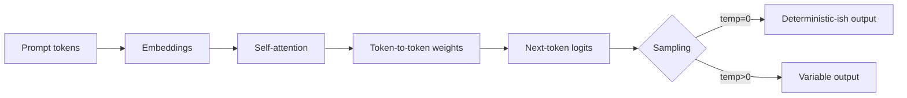

**Quick demo — try it locally:**

```bash
# clone, then just open the HTML files in a browser - no build, no install
open chapter_01_LLM_Basics/attention_interactive.html
open chapter_01_LLM_Basics/attention_is_all_you_need.html
```

Hover over tokens in `attention_interactive.html` to see the live attention matrix. Edit the input sentence to see weights shift in real time — that's the same mechanism that makes your prompt wording matter.

---

## Chapter 02 — Prompt Engineering for QA

This chapter turns prompt engineering into a repeatable QA skill. Three pillars:

1. **Anti-hallucination rules** — guardrails so the model only uses provided input.
2. **RICE-POT framework** — a structured prompt template (Role, Instructions, Context, Example, Parameters, Output, Tone).
3. **Two projects + six templates** — applied on real artifacts (a PRD-style API doc and a Selenium framework build).

**Q&A — RICE-POT vs free-form prompting:**
- **Q: I already get OK results from "write test cases for this PRD." Why bother with a framework?** A: "OK" is the ceiling. RICE-POT forces you to declare the persona, format, and constraints, which is what turns a 60% useful answer into a 95% useful one — every time, not just on lucky runs.
- **Q: Isn't this just over-engineering a chat message?** A: For one-offs, yes. For repeatable QA tasks (regression suites, security checklists, daily test-case generation), the template pays for itself within three uses.
- **Q: Which letter is most often skipped — and what breaks?** A: `P` (Parameters). Without the anti-hallucination block, the model invents fields, IDs, and error codes that don't exist in your PRD. Output looks plausible but ships bugs.

**RICE-POT prompt flow — from goal to copy-pasteable prompt:**

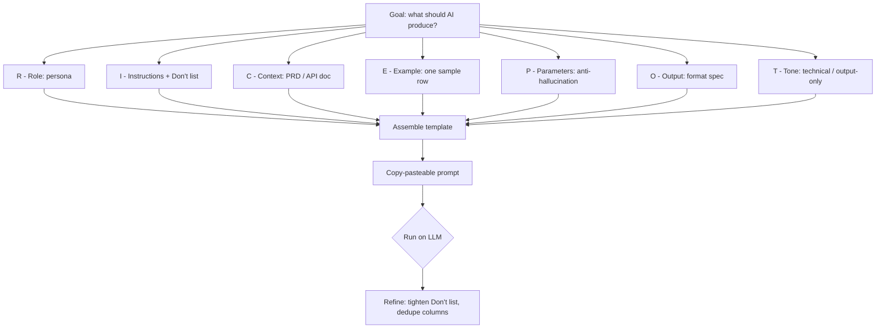

### Anti-Hallucination Rules (`Anti_Hallucinations_Rules.md`)

A drop-in `ROLE` block you prepend to any QA prompt. Forces the model to:
- Use only the inputs you provide (PRD, screenshots, API docs).
- Refuse to assume "typical" system behaviour.
- Output exactly `"Insufficient information to determine."` when an input is missing.
- Label inferred details as `"Inference (low confidence)"`.
- Produce a Verified Facts / Missing Info / Output / Self-Validation block.

Use this on every factual-generation prompt in this repo.

### Project 1 — Test Case Generation with RICE-POT

Goal: turn an API PDF (`Restful-booker.pdf`) into a CSV of enterprise-grade test cases.

- `RICE-POT-TestCase-Prompt.md` — the worked prompt. Targets `app.vwo.com` as the example product, but the structure transfers to any PRD/API doc.
- `RICE_POT_FRAMEWORK/RICE_POT.md` — explanation of each letter of the framework.
- `Restful-booker.pdf` + `Restful_Booker_API_Test_Cases.md` — input PDF and the generated test-case set.
- `output/deepseek_csv_20260524_0d9b7c.csv` — actual model output produced from the prompt.

**Q&A — Project 1 design choices:**
- **Q: Why a PDF input and not just pasted text?** A: PDFs mirror how QA actually receives PRDs and API specs. Forcing the model to extract from the document tests whether the prompt's anti-hallucination block holds under realistic input noise.
- **Q: Why CSV output instead of Markdown?** A: CSV imports cleanly into Jira, TestRail, qTest, and Zephyr. The model is told the exact column order so the file drops straight into a test-management tool.
- **Q: How do I trust the output?** A: Cross-check the `Traceability` column — every test case row must cite a section of the source PDF. Rows without traceability fail review.

**Sample output row (from `deepseek_csv_20260524_0d9b7c.csv`):**

```csv
TC_ID,Title,Preconditions,Steps,Test Data,Expected Result,Type,Priority,Traceability
TC_API_007,Create booking with valid payload,"Auth token obtained","POST /booking with required fields","firstname=Jim, lastname=Brown, totalprice=111, depositpaid=true","HTTP 200 + bookingid + booking object echoed back",Positive,High,"Restful-booker.pdf §Booking → CreateBooking"
```

**How to exercise it:**
1. Open `RICE-POT-TestCase-Prompt.md` in any AI tool (ChatGPT, Claude, Gemini, DeepSeek).
2. Attach `Restful-booker.pdf` (or your own PRD).
3. Confirm the output is CSV only, columns match the spec, and every test case traces back to the PDF.

### Project 2 — Selenium Framework from a Prompt

Goal: prove RICE-POT can build production code, not just test cases.

- `Problem.md` — the brief: "generate a Selenium framework from scratch with two page objects, production ready."
- `SKILL.md` — the RICE-POT prompt-builder skill definition. Tells the AI how to interview you, assemble the prompt, and deliver it copy-pasteable.
- `blank-template-rice-pot.md` — fill-in template with the recommended anti-hallucination Parameters block.
- `AdvanceSeleniumFramework/` — the actual output the framework generates:
  - Maven project, Java 11, Selenium 4.25, TestNG 7.10.
  - `LoginPage.java` — PageFactory POM with explicit waits, fluent API, no Thread.sleep.
  - `BaseTest.java` — driver lifecycle.
  - `ConfigReader.java` — `config.properties` loader.
  - `ValidLoginTest.java` / `InvalidLoginTest.java` — positive + negative TestNG cases.
  - `testng.xml` / `testng-smoke.xml` — full and smoke suites.

**Q&A — Project 2 design choices:**
- **Q: Why XPath only?** A: The prompt locked it to one locator strategy on purpose — consistency makes generated code reviewable. In production you'd mix CSS + XPath, but the discipline of "one strategy" is what the prompt enforces.
- **Q: Where do real credentials go?** A: `src/main/resources/config.properties`. Placeholders `REPLACE_WITH_...` fail fast in `@BeforeTest` so a forgotten config never silently passes a test.
- **Q: Why headless Chrome by default?** A: macOS 26.1 + Chrome 148 dropped windowed sessions mid-test in this repo. Headless avoids the focus/sandbox issue and is what CI uses anyway.

**Framework architecture — what the prompt generated:**

```mermaid
flowchart TD
    CFG[config.properties] --> CR[ConfigReader]
    CR --> BT[BaseTest]
    BT -->|@BeforeMethod| D[ChromeDriver headless]
    BT -->|@AfterMethod| Q[driver.quit]
    LP[LoginPage - POM + PageFactory] --> XP["@FindBy xpath only"]
    VT[ValidLoginTest] --> LP
    IT[InvalidLoginTest + @DataProvider] --> LP
    VT -.extends.-> BT
    IT -.extends.-> BT
    SUITE[testng.xml] --> VT
    SUITE --> IT
    SMOKE[testng-smoke.xml] --> IT
```

**LoginPage snippet (XPath + explicit waits, no Thread.sleep):**

```java
public class LoginPage {
    @FindBy(xpath = "//input[@id='username']") private WebElement usernameField;
    @FindBy(xpath = "//input[@id='password']") private WebElement passwordField;
    @FindBy(xpath = "//input[@id='Login']")    private WebElement loginButton;
    @FindBy(xpath = "//div[@id='error']")      private WebElement errorMessage;

    public LoginPage(WebDriver driver) {
        this.wait = new WebDriverWait(driver,
            Duration.ofSeconds(ConfigReader.getInt("timeout.explicit")));
        PageFactory.initElements(driver, this);
    }

    public void loginAs(String user, String pass) {
        wait.until(ExpectedConditions.visibilityOf(usernameField)).sendKeys(user);
        passwordField.sendKeys(pass);
        wait.until(ExpectedConditions.elementToBeClickable(loginButton)).click();
    }
}
```

**Run it:**
```bash
cd chapter_02_Prompt_Eng/Project2_Selenium_Framework/AdvanceSeleniumFramework
mvn -q clean test-compile
mvn test                       # full suite
mvn test -DsuiteXmlFile=testng-smoke.xml   # smoke only
```

### Templates — RTCFR + RICE-POT (`templates/`)

Six copy-paste prompt templates for the most common QA tasks. Each follows the **RTCFR** shape — Role, Task, Constraints, Format, Requirements — which is the lightweight cousin of RICE-POT.

| # | File | Purpose |
|---|------|---------|
| 01 | `01_TestCaseGeneration_Prompt.md` | Basic test-case generation from free-form requirements. |
| 02 | `02_TestCases_from_prd` | Comprehensive PRD → test cases (functional, negative, boundary, edge). |
| 03 | `03_API_Test_Generation.md` | API endpoint test cases from API docs. |
| 04 | `04_Negative_TC_Only.md` | Negative-only suite — invalid inputs, auth violations, malformed data. |
| 05 | `05_Secuirty_Test.md` | OWASP-top-10-aligned security test cases. |
| 06 | `06_Regression_Suite.md` | Regression suite for a module with execution-time estimates. |

**Use any template:**
1. Open the file and copy the fenced block.
2. Replace `[FEATURE]` / `[PASTE REQUIREMENTS]` / `[PASTE PRD]` etc. with your input.
3. Paste into your AI tool. Keep the `CONSTRAINTS` block intact — that's what stops hallucination.

---

## Chapter 03 — B.L.A.S.T. Jira Test Plan Generator

This chapter turns a Jira ticket into a formal QA test plan through a lightweight **React + Express** app. It uses the **B.L.A.S.T.** protocol (Blueprint, Link, Architect, Stylize, Trigger) and an **A.N.T.** 3-layer architecture.

**What's here:**
- `README.md` — setup, local run, production run, and Vercel deployment notes.
- `src/` — React UI for Settings, Generate, and Test Plan views.
- `server.js` + `tools/` — local Express proxy, Jira fetcher, GROQ client, and deterministic Markdown renderer.
- `api/` + `vercel.json` — serverless production deployment path.
- `architecture/` — SOPs for Jira fetch, GROQ generation, and the 13-section test-plan template.

**Why a QA engineer should care:** Jira tickets are often the real source of truth. This project shows how to keep credentials out of the browser, fetch ticket context safely, ask an LLM for structured JSON, and render a repeatable test plan without relying on free-form chat output.

**Run it locally:**
```bash
cd chapter_03_BLAST_FW_JIRA_AI_AGENT
npm install
npm run dev
```

Open `http://localhost:5173`, add Jira + GROQ credentials in the Settings tab, then generate a plan from a Jira ID.

---

## Chapter 04 — n8n and Local AI Agents for QA

This chapter adds importable **n8n** workflows and local AI-agent projects for practical QA and content automation. It shows how to connect chat triggers, LLM nodes, Jira tools, Google Sheets output, Slack/Teams triggers, CSV-driven batch processing, a local Next.js dashboard, local Excel persistence, and content-generation skill files.

**What's here:**
- `AI_3X_01_QA_Buddy.json` — chat-triggered QA assistant using a GROQ-backed LLM node.
- `AI_3X_02_JIRA_Agent.json` — chat agent that can create Jira tickets.
- `AI_3X_03_Read_PRD_TestCases_Excel.json` — fetches PRD/ticket context and writes generated test cases into Google Sheets.
- `AI_3X_04_Read_PRD_TestCases_Excel_v2.json` — extends the PRD-to-test-cases flow with CSV upload and batch Jira processing.
- `social_ai_agent/contentforge/` — local Next.js + TypeScript dashboard for a daily content-generation pipeline.
- `skillfile_content_generation/SKILL.md` — content engine skill for The Testing Academy publish-ready content packs.
- `skillfile_content_generation/output/2026-06-14/` — generated content pack for "Your AI Agent Needs a QA Contract, Not More Prompts."

**How to use the n8n workflows:**
1. Open n8n Cloud or a self-hosted n8n instance.
2. Import the JSON workflow from `chapter_04_AI_Agents_n8n/n8n_AIAgent/`.
3. Reconnect credentials for the nodes you use: GROQ, DeepSeek, Jira, Google Sheets, Slack, or Microsoft Teams.
4. Run the chat trigger, form trigger, schedule trigger, or team-channel trigger depending on the workflow.

**Run ContentForge locally:**
```bash
cd chapter_04_AI_Agents_n8n/social_ai_agent/contentforge
npm install
cp .env.example .env.local
npm run dev
```

Add your local keys to `.env.local` or `.env`:

```bash
GROQ_API_KEY=...
GEMINI_API_KEY=...
```

ContentForge keeps generated data local:

- `content_calendar.xlsx` in the app root.
- Generated runtime images under `public/images/`.
- API keys in `.env.local` or `.env`.

Those local files are ignored and should not be committed.

**Use the content skill output:**

Open `chapter_04_AI_Agents_n8n/skillfile_content_generation/output/2026-06-14/` for separate Markdown files covering the topic, LinkedIn post, Medium article, YouTube script, Instagram carousel copy, and image prompts.

---

## Chapter 05 — AI Agents with LangFlow

LangFlow is a visual, low-code builder for LLM apps and agents — wire components on a canvas,
test the flow live, then call it over a REST endpoint (`POST /api/v1/run/{flowId}`) from any
front end or CI job. This chapter builds two real QA agents on top of that API:

- **Flaky Test Analyzer** — compares two Playwright `results.json` runs and reports genuine
  flaky tests vs. consistent failures, with a React UI and rerun recommendations.
- **API Contract Validator** — calls a live endpoint and validates the response against a JSON
  Schema using an OpenRouter model, catching contract drift without per-endpoint assertion code.

**Run the Flaky Test Analyzer UI:**
```bash
cd chapter_05_AI_Agents_LangFlow/flaky_test_analyzer_ai_Agent/ui
npm install
npm run dev          # http://localhost:5173, proxies LangFlow at :7861
```

LangFlow must be running locally with the agent flow imported (`Project/002_Flaky_Test_AIAgent.json`).
See `chapter_05_AI_Agents_LangFlow/README.md` for full flow details and example verdicts.

---

## Chapter 06 — AI Social Media Content Creation

Fill-in-the-blank templates that turn **one idea** into a publish-ready pack across seven
platforms — plan once (Hook–Story–Offer), then repurpose everywhere instead of writing seven
things from scratch.

| # | Template | Use it for |
|---|----------|-----------|
| 00 | Hook · Story · Offer Planning | Plan any idea before writing a single post |
| 01 | YouTube Video | Long/short-form video script |
| 02 | Instagram Reel | Vertical short video + on-screen text |
| 03 | Instagram Post | Single-image post + caption |
| 04 | Instagram Carousel | 7–9 slide reference card |
| 05 | Medium Article | Long-form article (1,500–3,500 words) |
| 06 | Blog Post | SEO-aware blog post |
| 07 | LinkedIn Post | LinkedIn post + publishing notes |

Universal voice rules (senior-colleague-over-chai tone, no banned buzzwords, no fabricated
stats) apply across every template. See `chapter_06_AI_Social_Media_Content_Creation/README.md`.

---

## Chapter 07 — RAG

A hands-on **Retrieval-Augmented Generation** demo, end to end, with a React UI that shows every
stage of the pipeline instead of hiding it behind a single "ask a question" box:

```
PDF/TXT  →  Chunk  →  Nomic Embed  →  ChromaDB  →  Retrieve top-k  →  Groq answer
```

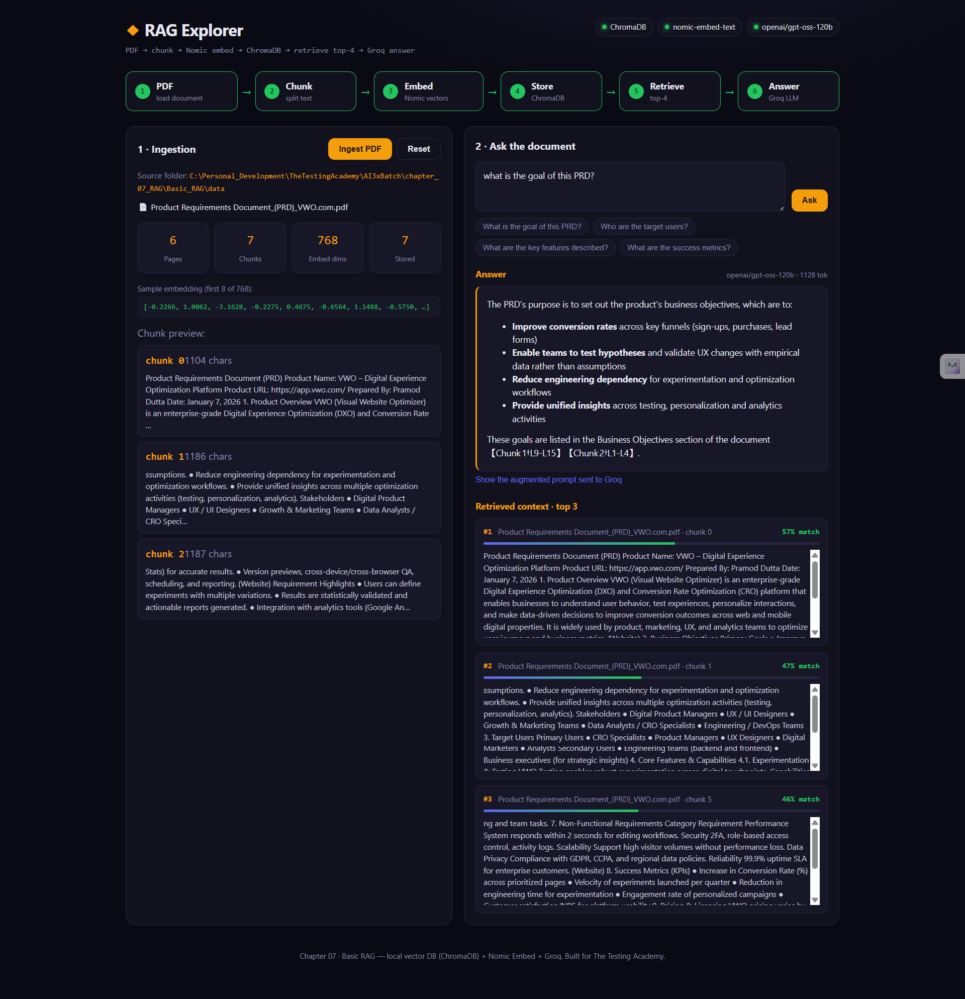

- **Ingestion:** drop `.pdf`/`.txt` files into `Basic_RAG/data/`, or use the **Upload PDF/TXT**
  button in the UI to add them from the browser (saved server-side, 20MB cap). Ships with two
  sample docs — a VWO PRD and a Restful-booker API spec — and **Ingest Docs** processes every
  supported file in one pass.
- **Embeddings:** `nomic-embed-text` via local **Ollama** — no API key, runs offline.
- **Vector store:** local **ChromaDB** server (cosine similarity).
- **LLM:** **Groq** `openai/gpt-oss-120b` for the grounded final answer.

**Why a QA engineer should care:** it's the same "generate from a source doc" shape as Chapter 02,
except every intermediate step is visible — chunk boundaries, a real embedding vector, similarity
scores — which is what lets you debug a RAG agent that hallucinates or misses an obvious answer.

**Run it:**
```bash
cd chapter_07_RAG/Basic_RAG/rag-explorer
npm install
cp .env.example .env      # paste your GROQ_API_KEY into .env
npm run dev                # ChromaDB (:8000) + Express API (:8787) + Vite UI (:5173+)
```

Requires Ollama running with `nomic-embed-text` pulled, and `pip install chromadb` for the
`chroma` CLI. Full architecture, config table, and troubleshooting in `chapter_07_RAG/README.md`.

### No-code variant: RAG in n8n

Same RAG shape, built as an **n8n workflow** instead of hand-written code — for learners who want
the pipeline without writing a backend.

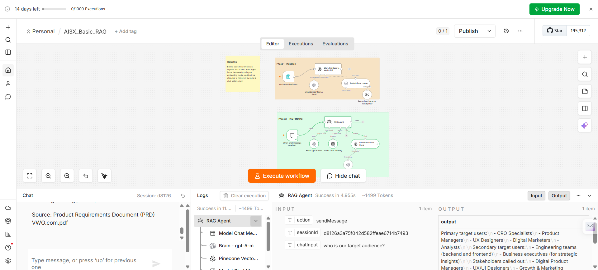

```
Form Upload  →  Recursive Character Text Splitter  →  OpenAI Embeddings  →  Pinecone (insert)
Chat Trigger →  RAG Agent (gpt-5-mini)  →  Pinecone (retrieve-as-tool, top-3)  →  Answer + citation
```

- **Phase 1 — Ingestion:** an n8n **Form Trigger** accepts PDF/CSV/JSON/DOCX/TXT/HTML uploads,
  chunks them with `chunkOverlap: 200`, embeds via **OpenAI embeddings**, and inserts into a
  **Pinecone** index (`ai3x-1536`).
- **Phase 2 — RAG Fetching:** a **Chat Trigger** feeds a LangChain **Agent** (`gpt-5-mini` brain +
  buffer-window memory) that calls Pinecone as a retrieval tool (top-k = 3) and is prompted to
  answer **only** from retrieved documents, citing the source `fileName`, or say
  *"I couldn't find that in the uploaded documents."*
- Import `chapter_07_RAG/n8n_Basic_RAG/AI3X_Basic_RAG.json` into n8n and wire up your own OpenAI
  and Pinecone credentials (the JSON ships with placeholder credential IDs, not real keys).

### No-code variant: RAG in LangFlow

Same RAG shape again, this time built visually in **LangFlow**. Three exported flows in
`chapter_07_RAG/LangFlow_RAG/` show the pipeline evolving from a first pass to a tuned one:

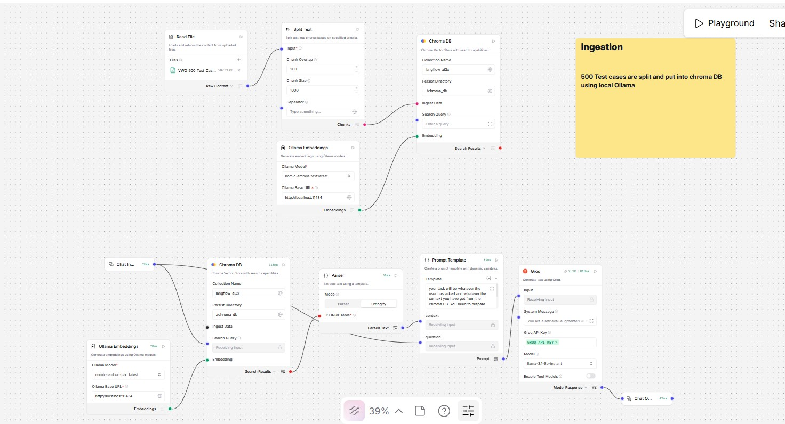

```
File (PDF/TXT) → Split Text (chunk) → Embeddings → Chroma DB (ingest)

Chat Input (question) → Chroma DB (retrieve top-k) → Prompt Template (context + question) → LLM → Chat Output
```

- **`AI_3x_Naive_RAG_Ollama_Groq.json`** — local **Ollama** (`nomic-embed-text`) embeds both the
  ingested chunks and the incoming question; **Groq** is the language model that generates the
  grounded answer. Fully local embedding step, hosted inference for the final answer.
- **`AI_3X_Naive RAG Uploaded.json`** — swaps in **OpenAI embeddings** and **OpenAI** as the
  language model; ingest and query share a single Chroma DB component.
- **`AI_3X_Naive RAG_Improve_Chunk.json`** — same OpenAI stack, but ingest and query each get
  their own dedicated embedding + Chroma DB component instead of sharing one, plus an extra
  Parser stage after retrieval — a tuned-chunking iteration on the naive flow.
- **`AI_3X_Naive RAG_Task11July2026.json`** — swaps the source data for QA test-case CSVs
  (`data/Ecommerce_1000_Test_Cases.csv`, `data/VWO_500_Test_Cases.csv`) instead of a PRD/API PDF,
  using **MistralAI Embeddings** for ingest/retrieve and **Groq** as the answering LLM. Proves the
  same RAG shape works over structured test-case rows (Scenario, Priority, Automated flag, Steps)
  so a tester can ask natural-language questions against a test-case repository instead of
  grepping a spreadsheet. Sample questions in `prompt/prompt.md`:
  - "Show me critical priority checkout test cases that are automated"
  - "Show me scenario 47 from cart"
  - "What test cases cover refunds via UPI?"

  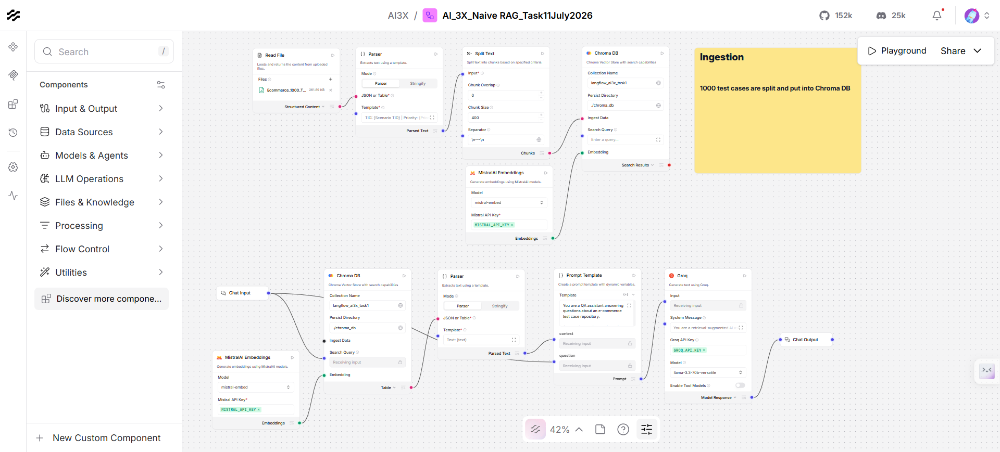
  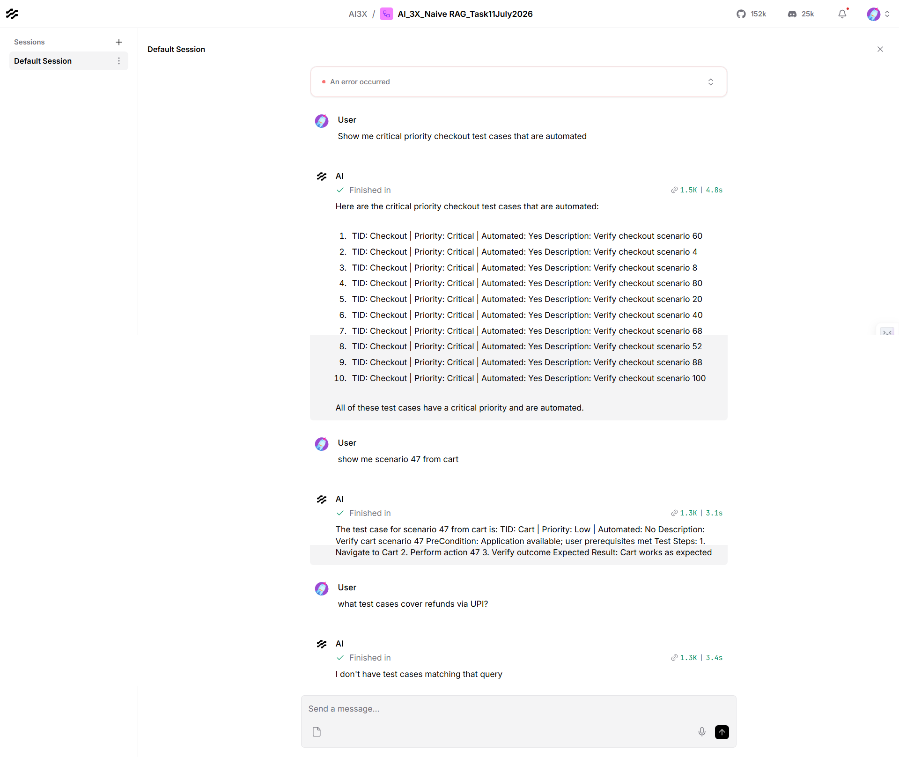
- Import any of the four JSON files into LangFlow and wire up your own Ollama/OpenAI/Mistral/Groq
  credentials (exports carry component IDs, not live keys).

### LangFlow RAG Explorer — chat UI over the LangFlow REST API

`chapter_07_RAG/LangFlow_RAG/rag-explorer` is a thin **React + Vite** chat UI wired to the
`AI_3X_Naive RAG_Task11July2026.json` flow above (Mistral embeddings + Groq). Unlike the Basic RAG
Explorer, this app has **no backend of its own** — LangFlow does all retrieval and generation;
the app only calls LangFlow's REST API and renders the answer:

```
File → Parser → Split Text → Mistral Embeddings → ChromaDB (top 10)
     → Prompt Template → Groq llama-3.3-70b-versatile → Chat Output
```

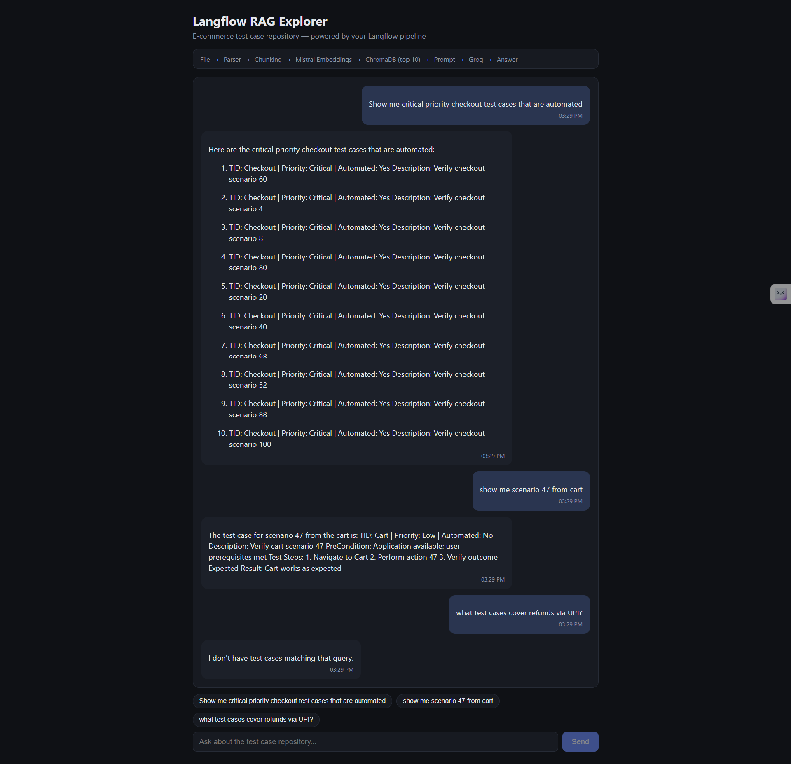

- Browser calls same-origin `POST /api/chat`; Vite's dev proxy (`vite.config.js`) rewrites it to
  `POST http://localhost:7860/api/v1/run/<flowId>?stream=false` and attaches the `x-api-key`
  header **server-side**, so the key never appears in a browser network call.
- Answer text is defensively extracted from `outputs[0].outputs[0].results.message.text`; if
  LangFlow's response shape ever changes, the UI falls back to a collapsible raw-JSON block
  instead of a blank bubble.
- Ships the same three sample questions as clickable chips, and reuses one `session_id` per
  browser tab so LangFlow keeps a single chat history thread.

**Run it:**
```bash
cd chapter_07_RAG/LangFlow_RAG/rag-explorer
npm install
cp .env.example .env      # VITE_LANGFLOW_BASE_URL / _FLOW_ID / _API_KEY
npm run dev                 # http://localhost:5176, proxies /api/chat to LangFlow on :7860
```

Requires LangFlow running with the flow imported and ChromaDB already ingested (see above), plus
a Langflow API key from LangFlow's Settings → **Langflow API Keys**. A `401`/`403` in the chat
means that key is invalid or expired — regenerate it and restart `npm run dev` (env vars are only
read at server boot). Full env var table, file layout, and error-handling reference in
`chapter_07_RAG/LangFlow_RAG/rag-explorer/README.md` and `chapter_07_RAG/README.md`.

### Advanced RAG Explorer — hybrid retrieval, RRF fusion, reranking

`chapter_07_RAG/Advance_RAG/` upgrades the Basic RAG shape with the four techniques that actually
move the needle at scale, over a real corpus (5,000 seeded VWO test cases) instead of a couple of
sample PDFs:

```
Ingest:  CSV/XLSX -> chunk -> bge-m3 (dense + sparse) -> Qdrant
Chat:    query -> rewrite -> dense + sparse search -> RRF fuse -> bge-reranker -> LLM
```


| Technique | What / why |
|-----------|------------|
| **Hybrid retrieval** | `BAAI/bge-m3` emits **dense + sparse** vectors from one model — semantic recall *and* exact keyword/ID match (e.g. `VWO-1234`, module names). |
| **RRF fusion** | Reciprocal Rank Fusion merges the dense and sparse rankings without tuning score scales. |
| **Cross-encoder rerank** | `BAAI/bge-reranker-v2-m3` re-scores fused candidates by reading query+chunk together — sharper than vector similarity alone. |
| **Query rewriting** | The LLM expands the question into alternate phrasings before retrieval, widening recall. |

Vector DB is **Qdrant embedded** (local file store, no Docker). Generation uses **Groq**
`openai/gpt-oss-120b` by default, switchable to OpenRouter via `.env`. The UI has four tabs —
**Upload** (CSV/XLSX, choose text vs. metadata columns), **Ingest** (live SSE progress through
Read → Build → Chunk → Embed → Index), **Chunks** (paginated viewer with substring search +
`priority`/`module`/`jira_id` filters), and **Chat** (dense vs. sparse vs. RRF-fused rankings,
rerank before/after, grounded answer with `[Chunk N]` citations).


**Why a QA engineer should care:** exact-ID lookups (`VWO-1234`) are exactly where pure dense
embedding search falls over — sparse retrieval catches the literal token match that semantic
similarity alone misses. Watching RRF fuse the two ranked lists, then watching rerank reorder them
again before the LLM ever sees the context, is the clearest way to see why "just embed and
cosine-search" stops being good enough once a corpus gets specific and large.

**Run it:**
```bash
cd chapter_07_RAG/Advance_RAG
python3 -m venv .venv
source .venv/bin/activate      # Windows: .venv\Scripts\activate
pip install -r requirements.txt
cp .env.example .env           # paste your GROQ_API_KEY
python app.py
# open http://127.0.0.1:5050
```

Qdrant runs embedded at `./qdrant_data/` — nothing to start. First ingest/chat downloads the
models once (`bge-m3` ~2.3 GB, `bge-reranker-v2-m3` ~570 MB from the HF cache); after that it is
fast. Qdrant local mode is single-writer, so don't run `app.py` and `ingest.py` at the same time
against the same `qdrant_data/`. Full tunables table (`CHUNK_SIZE`, `TOP_N_HYBRID`, `TOP_K_RERANK`,
`RRF_K`, `REWRITE_ENABLED`) and troubleshooting in `chapter_07_RAG/Advance_RAG/README.md`.

---

## Chapter 08 — QABuddy.ai

`chapter_08_QABuddyAI/` is a full multi-source **hybrid RAG** backend built for a QA team's real
knowledge base — not a couple of sample PDFs, but ten source types at once: two test-automation
repos (Selenium + Playwright), a 5,000-row test-case corpus, JIRA history, company docs, meeting
notes, Lucid flow exports, PRDs, and Jenkins CI logs.

```
Ingest:  data/01..10 -> per-source loader -> chunk -> BGE-M3 (dense + sparse, one pass) -> Qdrant
Ask:     question -> condense -> rewrite (3x) -> hybrid search -> RRF fuse -> rerank -> cited answer
```

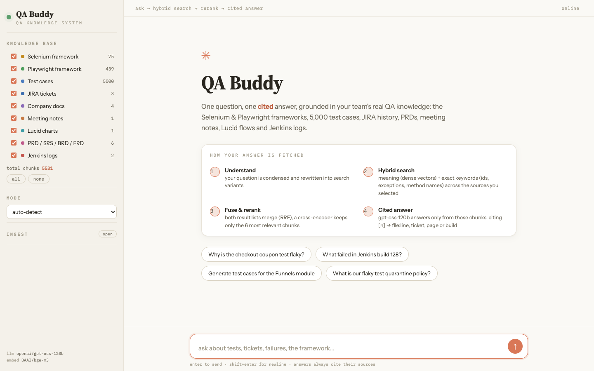

- **Embeddings:** `BAAI/bge-m3` — one model, one `encode()` call, returns dense (semantic) **and**
  lexical sparse vectors, so exact identifiers (`VWO-123`, `NoSuchElementException`) retrieve
  alongside fuzzy intent.
- **Vector store:** **Qdrant**, embedded locally (no Docker) or as a server on the droplet —
  switched by one env var, no code change.
- **Fusion + rerank:** dense and sparse hit lists merge via **Reciprocal Rank Fusion**, then
  `BAAI/bge-reranker-v2-m3` cross-encodes the fused top-12 down to the best 6 chunks.
- **Answer LLM:** **Groq** `openai/gpt-oss-120b`, streamed token-by-token over SSE, prompted to
  cite every claim as `[n]` and say what's missing rather than invent it.
- **Modes:** the same ask pipeline detects intent from the question — `answer`, `generate` (new
  test cases), `review` (coverage gaps), or `rca` (root cause analysis) — and swaps system prompts
  accordingly.
- **Ingestion is idempotent:** a per-file manifest hash means re-running ingest only re-embeds
  changed files; unchanged files are skipped.

**Why a QA engineer should care:** this is the RAG shape from Chapter 07's Advanced RAG Explorer,
grown up to production concerns — nine heterogeneous real-world source types instead of one CSV,
a relevance gate that refuses to answer below a confidence threshold instead of always generating
something, and a droplet deployment path (Docker Compose + Caddy TLS) alongside the local one.

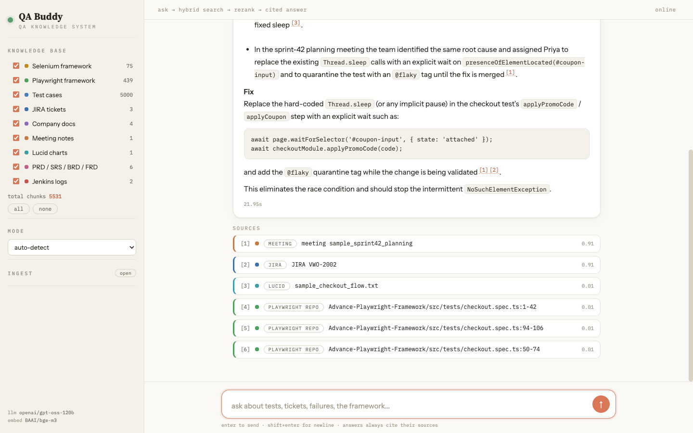

**Ask pipeline — from question to cited answer:**

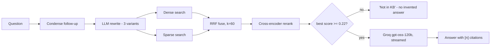

**Q&A — design choices:**
- **Q: Why dense *and* sparse from the same model instead of a separate keyword index?**
  A: `BAAI/bge-m3` emits both in one `encode()` call — one model to load, one embedding pass per
  chunk, and RRF fusion needs no score-scale tuning between two disjoint retrieval systems.
- **Q: What stops it from hallucinating when the knowledge base doesn't have the answer?**
  A: A hard relevance gate in `app/retrieval.py` — if the best reranked score is below `0.22`, the
  pipeline returns a fixed "not in the KB" message and never calls the LLM at all.
- **Q: Why rebuild the reranker on raw `transformers` instead of using FlagEmbedding's built-in one?**
  A: FlagEmbedding 1.4.0's `FlagReranker.compute_score` calls a tokenizer method
  `bge-reranker-v2-m3`'s XLM-R tokenizer doesn't expose. Loading it as a plain
  `AutoModelForSequenceClassification` and sigmoid-ing the logits ourselves is version-robust.

**Run it:**
```bash
cd chapter_08_QABuddyAI
uv venv .venv --python 3.13 && uv pip install -p .venv/bin/python -r requirements.txt
cp .env.example .env                 # put your GROQ_API_KEY in it
./scripts/fetch_repos.sh             # clone the two framework repos
./scripts/setup_fixtures.sh          # demo CSV + PRD from chapter 07
.venv/bin/python -m app.ingestion.cli ingest --all
.venv/bin/python -m pytest tests -q  # unit tests
./scripts/dev.sh                     # UI on http://127.0.0.1:5080
```

On Windows, `uv venv` creates `.venv\Scripts\python.exe` rather than `.venv/bin/python` —
`scripts/dev.sh` assumes the Linux layout, so run the server module directly instead:
`.venv\Scripts\python.exe -m app.server.app`.

Full pipeline design in `chapter_08_QABuddyAI/docs/architecture.md`, a standalone visual walkthrough
in `qabuddy-architecture.html`, and backend implementation notes (stack choices, ingestion/retrieval
internals, real bugs hit and fixed) in `docs/build-notes.html` — open either directly in a browser.

---

## Project - Job Tracker AI

`Project_Job_TRACKERAI/` is a local-first job application tracker built as a Vite + React single-page app. It stores every job card in the browser with IndexedDB through the `idb` library, so there is no backend, authentication, or external database.

**What's here:**
- Six Kanban columns: Wishlist, Applied, Follow-up, Interview, Offer, and Rejected.
- Drag-and-drop cards between columns with `@dnd-kit/core`.
- Add, edit, delete, search, and sort job cards.
- Resume-name reuse, LinkedIn job links, days-since-applied labels, salary notes, and status color accents.
- Light/dark mode plus JSON export/import for backups.

**Run it locally:**
```bash
cd Project_Job_TRACKERAI
npm install
npm run dev
```

Open the local Vite URL and use the app directly in the browser. Data persists in the browser's IndexedDB database named `job-tracker-ai`.

---

## Chapter 10 — MCP Creation (VIBE)

`chapter_10_MCP_Creation_VIBE/` builds **one runnable MCP server** with **FastMCP** that makes the
distinction between the three MCP primitives concrete instead of abstract:

- **Tools** — model-invoked actions that return data.
- **Resources** — application-controlled context, addressed by URI (including a templated one).
- **Prompts** — user-invoked message templates for an LLM client, not data lookups.

All three sit over one in-memory dataset — a 200-row VWO manual-test-case CSV export
(`resource/vwo_5000_test_cases.csv`) loaded once at server startup, never re-read per request.

```
CSV (loaded once at startup) -> in-memory list[dict] + issue_key index
        |-- Tools:     search_test_cases / get_test_case / test_case_stats
        |-- Resources: testcases://schema / testcases://all / testcases://module/{name}
        `-- Prompts:   review_test_case / generate_regression_suite
```

**What's here:**
- `Prompt.md` — the RICE-POT-style build spec: role, instructions, context, a worked example, and
  a 3-phase process (confirm schema → generate code → verify in Inspector) that gated each step on
  explicit sign-off before continuing.
- `testcase-creator-mcp/server.py` — the server itself (~205 lines): typed tool/resource/prompt
  functions, `ToolError`/`ResourceError`/`PromptError` for readable MCP errors on bad input (unknown
  `issue_key`, unknown module, invalid `group_by`), `logging` to stderr only (stdout stays clean for
  the stdio JSON-RPC stream), and a CSV path resolved relative to the file with a `VWO_CSV_PATH`
  environment-variable override.
- `testcase-creator-mcp/pyproject.toml` — `fastmcp==2.14.7` pinned, managed with `uv`.
- `testcase-creator-mcp/README.md` — run/inspect commands and a `claude_desktop_config.json`
  snippet to register the server with Claude Desktop.
- `README.md` (chapter-level) — the full MCP Inspector walkthrough below, screenshot by screenshot.

**Q&A — design choices:**
- **Q: Why read the CSV header and stop for confirmation before writing any code?** A: The prompt's
  assumed columns (`ID`, `Module`, `Title`...) didn't match the real header
  (`Issue Key`, `Component`, `Summary`...). Generating code against a guessed schema would have
  produced a server that silently returned `KeyError`s on every call.
- **Q: Why three separate exception types (`ToolError`, `ResourceError`, `PromptError`) instead of
  one generic error?** A: Each MCP primitive surfaces errors through a different protocol channel;
  using the type FastMCP defines per primitive keeps the Inspector's error display accurate instead
  of showing a raw Python traceback.
- **Q: Why does `test_case_stats` accept `"module"` as an alias for the `Component` column?** A: The
  prompt's example tool signature used `group_by` on "module/priority/status", but the real CSV
  column is named `Component`. Aliasing keeps the tool's public API matching the spec while mapping
  onto the real column internally.

**MCP Inspector walkthrough (screenshots 01-09):**

| # | Screenshot | Shows |
|---|------------|-------|
| 1 | `01_MCP-Inspector_OnLoad.png` | Inspector disconnected; `STDIO` transport, `fastmcp run server.py --no-banner`. |
| 2 | `02_MCP-Inspector_Connection_Established.png` | Connected — `initialize` handshake in History, startup log in Server Notifications. |
| 3 | `03_MCP-Inspector_Resources_List.png` | `testcases://schema` and `testcases://all` listed; templated `testcases://module/{name}` under Resource Templates. |
| 4 | `04_MCP-Inspector_Prompts_WIth_Example.png` | `review_test_case(issue_key="VWO-1001")` rendered as an actual `role: user` message array. |
| 5 | `05_MCP-Inspector_Tools_List.png` | All three tools listed with their docstring-derived descriptions. |
| 6 | `06_MCP-Inspector_Tools_WIth_Example1.png` | `search_test_cases(query="scheduled email", limit=3)` → 3 matching rows, schema-valid. |
| 7 | `07_MCP-Inspector_Tools_WIth_Example2.png` | `get_test_case(issue_key="VWO-1003")` → full row. |
| 8 | `08_MCP-Inspector_Tools_WIth_Example3.png` | `test_case_stats(group_by="status")` → `{Ready: 94, Draft: 33, Automated: 60, Deprecated: 13}`. |
| 9 | `09_MCP-Inspector_Disconnect.png` | Clean disconnect, ready to reconnect. |

Full per-screenshot narrative in `chapter_10_MCP_Creation_VIBE/README.md`.

**Run it:**
```bash
cd chapter_10_MCP_Creation_VIBE/testcase-creator-mcp
uv sync
uv run fastmcp dev server.py     # opens MCP Inspector in the browser, connected over stdio
```

Register with Claude Desktop via the `claude_desktop_config.json` snippet in
`testcase-creator-mcp/README.md` — set `--directory` to this project's absolute path.

---

## Chapter 11 — Python Learning

`chapter_11_Python_Learning/` steps back from the AI-agent chapters to cover core Python
fundamentals as standalone, runnable lab scripts — no frameworks, no dependencies, one concept
per file. Eighteen exercise sets plus a task folder, in order:

- **`ex_01_Python_Basics/`** — `print()`, comments, running a `.py` file.
- **`ex_02_Keywords_Identifier_Variables/`** — identifier rules, keywords, dynamic typing,
  arithmetic/BODMAS, multiple assignment. `rules_for_identifier.md` is the reference doc: allowed
  characters, can't start with a digit, can't be a keyword, case sensitivity, and the PEP 8 naming
  table (`snake_case` vars, `UPPER_SNAKE_CASE` constants, `PascalCase` classes).
- **`ex_03_Literals/`** — literals (decimal/binary/octal/hex), multi-line comments,
  `type()`/built-in functions, `input()`, string basics, string↔int conversion, escape sequences
  (`\n`/`\t`/`\b`), single vs. double quotes, and two capstone tasks (arithmetic on two inputs;
  quotient/remainder on two inputs).
- **`ex_04_Operators/`** — arithmetic, assignment, comparison, logical (`and`/`or`/`not`), power
  (`**`), floor vs. true division (`//` vs `/`), `divmod()`, ternary expressions, and membership
  (`in`/`not in`).
- **`ex_05_Condition_Loops/`** — `if`/`elif`/`else`, nested conditions with input validation,
  even/odd and max-of-3 problems.
- **`ex_06_Switch_Match/`** — `match`/`case` for a day-of-week lookup and a QA test-type
  selector (API/UI/Performance/Security).
- **`ex_07_Loops/`** — `for`/`while`, `range(start, stop, step)`, `break`, `continue`, `pass`,
  even/odd number generation.
- **`ex_08_Functions/`** — built-in vs. user-defined functions, the four parameter/return
  combinations, default parameters, keyword arguments, multiple return values (tuple unpacking),
  `*args` for infinite positional arguments, and inner-function scope IQ puzzles.
- **`ex_09_Functions_Scopes/`** — local vs. global variables, why a local var can't leak out of a
  function, shadowing a global name with a local assignment inside a function, and inner-function
  closures (outer var visible to an inner function; the inner function's own locals stay isolated).
- **`ex_10_Decorators/`** — a decorator as a function that wraps another function: `@syntax`
  sugar, before/after behaviour (`add_security`, `before_after_ui_test`), the same shape written
  manually without a decorator for comparison, stacking two decorators and reading execution order
  top-down, and a `time`-module timing decorator around real test functions.
- **`ex_11_TypeConversion/`** — explicit type conversion with `int()`/`str()`/`float()`/`bool()`/
  `list()`/`tuple()`/`set()`/`dict()`/`complex()`, `type()` before and after.
- **`ex_12_Lambda_Exp/`** — `lambda` as a single-line function: 1/2/3-argument lambdas compared
  against an equivalent `def`, a ternary expression inside a lambda, and `input()` piped straight
  into a lambda call.
- **`ex_13_LIST/`** — list basics (`type()`, `len()`, indexing, mixed-type lists), mutating
  methods (`append`/`extend`/`insert`/`remove`/`pop`/`clear`/`sort`), `index()`/`count()`,
  `max()`/`min()`/`sum()`, slicing, nested lists, and mutability vs. `copy()`.
  `List_Methods_Notes.md` is the cheat sheet — which methods mutate in place and which return a
  new value (the `sort()` vs `sorted()` class of bug).
- **`ex_14_Tuple/`** — tuple immutability, mixed-type tuples, the single-element `(3,)` comma
  trap, `list()`↔`tuple()` conversion, iterating a tuple, and a real-world use case (a fixed set
  of API URLs that shouldn't be accidentally mutated).
- **`ex_15_SET_MAP_DICT/`** — sets as unordered collections of unique values: duplicates dropped
  silently on literal creation, `set(list)` as the one-line dedupe, `add()`/`remove()`, the four
  algebra operations (`|`/`union`, `&`/`intersection`, `-`/`difference` in both directions), set
  comprehensions, and `frozenset` for an immutable set.
- **`ex_16_MAP_Filters/`** — `filter()` keeps a subset (even numbers, only `PASS` results, drop
  empty strings) while `map()` transforms every element and always returns the same-size result
  (squares, uppercase names, response times ms → seconds). Both shown with a named `def` first,
  then the `lambda` equivalent; both need `list()` around them because they return lazy iterators.
- **`ex_17_Dict/`** — key-value CRUD (read, update, `del`, `.items()` loop, `in` tests keys not
  values), duplicate keys where the last one wins, nested dicts inside a list with chained `[]`
  access, `dict(zip(keys, values))` (extra keys silently dropped when the lists are uneven),
  `dict1 | dict2` merge, `.get(key, default)` — including the classic character-frequency counter
  built on `char_count.get(char, 0) + 1` — and dict equality ignoring key order.
- **`ex_18_OOPs_Python/`** — object-oriented Python, one folder per pillar. Five folders built out:
  - **`01_Class_Object/`** — `Lab120_Class.py` defines a `Person` class showing class attributes
    and all four method shapes (arg/no-arg × return/no-return) plus what `self` is for;
    `Lab121_Class_DOG.py` covers object vs. object reference (`chow = Dog()`), why a method body
    must say `self.name` and not bare `name`, and why `print(chow.talk())` prints an extra `None` —
    a function without an explicit `return` returns `None`.
  - **`02_Constructor/`** — `__init__` as the method Python calls automatically on object creation:
    the default constructor (`Lab122.py`), the parameterized one (`Lab123_PC.py` — and the trap that
    defining a parameterized constructor removes the no-arg one, so `Dog()` now fails), two objects
    reading the same untouched class attribute (`Lab124_IQ.py`), taking `input()` inside the
    constructor (`Lab125_USer_Input_Class.py`), a `Calc` class with `sum`/`sub`/`mul`/`div` over two
    float inputs (`Lab126_IQ.py`), and two `Baby` objects proving each keeps its own instance state
    (`Lab127_Baby.py`).
  - **`03_Instance_Variable/`** — the three scopes side by side in one file: a module-level global
    `a`, a class/instance attribute `b` read via `self.b`, and a method-local `l` that dies with the
    call. A method can read the global without declaring it; a local can't be seen from another
    method.
  - **`04_Encapsulation/`** — bundling data with the methods that use it, then restricting access.
    `Lab129_Encap.py` bundles constructor args as instance state; `Lab130_Encap.py` compares login
    input against **hardcoded** credentials (deliberately the wrong way), and `Lab131_Encap_NICE.py`
    fixes it by pulling them from a `.env` file via `python-dotenv` + `os.getenv()`.
    `Lab132_Encap_Better.py`, `Lab134_Ecap_REAL.py`, and `Lab135_PPP.py` drill the three access
    levels — `public`, `_protected` (convention only), `__private` (name-mangled, `AttributeError`
    from outside) — including private *methods*, not just variables.
    `Lab133_Encap_Example.py` is the payoff: a `Bank` class with a public `balance` but a
    `__account_number` that only comes out through an `is_auth` gate.
  - **`05_Inheritance/`** — all five forms, each framed as a test-framework class hierarchy:
    **single** (`LoginTest(BaseTest)` inherits `driver` + `setUp()`), **multiple**
    (`TestHybrid(APIBase, DBBase)`), **MRO** (`Lab_138_03_MI_002.py` — both parents define
    `money()`, so the order in the class declaration decides which one runs; `Child(Father1,Father2)`
    vs `Child2(Father2,Father1)` print different things), **multilevel**
    (`TestSuite → BaseTest → UITest`), **hierarchical** (`LoginTest` + `SignupTest` sharing one
    `BaseTest`), and **hybrid** (the diamond `Base → A, B → C`). `Lab_142_REAL.py` ties it back to
    real automation — a `BaseTest(browser)` constructor reused by both child test classes, which is
    exactly the `BaseTest`/page-object shape used in Chapter 02's Selenium framework.
  - Folders `06_Polymorphism`, `07_Abstraction`, and `08_Static` are scaffolded for the next labs.
- **`Task/`** — small capstone problems combining the above: `GradeCalculator.py` (score → letter
  grade), `PythonTask1.py`/`PythonTask2.py` (arithmetic + quotient/remainder, done twice — inline
  and via a function), `Sum_of_three_Numbers.py` (sum with default fallback values), and two
  set-based string problems — `SET_First_NonRepeatingChar.py` (first non-repeating character, via
  `string.count(char) == 1` with an early `return`) and `SET_All_NonRepeatingChar.py` (all of
  them, collected into a set).

**Why a QA engineer should care:** these labs underpin every other chapter's automation code —
`ConfigReader.java`-style dynamic config reading, CSV/JSON parsing in the RAG and MCP chapters,
and Selenium page objects all lean on the same identifier/typing/input/control-flow/function
fundamentals drilled here.

**Sample lab (`Lab008_Dynamically_typed.py`) — same name, type changes per reassignment:**

```python
age = 98
print(type(age))   # <class 'int'>
age = "Pramod"
print(type(age))   # <class 'str'>
age = True
print(type(age))   # <class 'bool'>
```

**Sample lab (`ex_18_OOPs_Python/01_Class_Object/Lab121_Class_DOG.py`) — object ref, `self`, and the phantom `None`:**

```python
class Dog:
    name = None          # class attribute, shared default

    def talk(self):      # self = the instance the method was called on
        print("Talking")

chow = Dog()             # Dog() creates the object; chow is the reference to it
print(chow.name)         # None  - falls back to the class attribute
print(chow.talk())       # Talking, then None - talk() has no return statement
```

**Sample lab (`ex_18_OOPs_Python/05_Inheritance/Lab_138_03_MI_002.py`) — MRO: declaration order wins:**

```python
class Father1:
    def money(self): print("F1 Money")

class Father2:
    def money(self): print("F2 Money")

class Child(Father1, Father2):    # MRO: Child -> Father1 -> Father2
    def give_money(self):
        self.money()              # F1 Money

class Child2(Father2, Father1):   # MRO: Child2 -> Father2 -> Father1
    def give_money(self):
        self.money()              # F2 Money
```

Same two parents, same method name — only the order in the class declaration changed. That is the
Method Resolution Order, and it's the bug you hit when two mixins both define `setup()`.

**Run any lab:**
```bash
cd chapter_11_Python_Learning
python ex_01_Python_Basics/Lab001_Hello.py
python ex_02_Keywords_Identifier_Variables/Lab011_IQ_BODMAS.py
python ex_03_Literals/Lab022_User_Input_Sum_Of_Two_numbers.py
python ex_06_Switch_Match/LabSwitch02.py
python ex_08_Functions/Lab072_Infinite_Args.py
python ex_10_Decorators/Lab082.py
python ex_13_LIST/Lab098_POP.py
python ex_14_Tuple/Lab101.py
python ex_15_SET_MAP_DICT/Lab103_SET.py
python ex_16_MAP_Filters/Lab107_Lab.py
python ex_17_Dict/Lab117_IQ.py
python ex_18_OOPs_Python/01_Class_Object/Lab121_Class_DOG.py
python ex_18_OOPs_Python/02_Constructor/Lab123_PC.py
python ex_18_OOPs_Python/03_Instance_Variable/Lab128_Instance_Varaible.py
python ex_18_OOPs_Python/04_Encapsulation/Lab133_Encap_Example.py
python ex_18_OOPs_Python/05_Inheritance/Lab_138_03_MI_002.py
python Task/GradeCalculator.py
python Task/SET_First_NonRepeatingChar.py
```

Each `LabNNN_*.py` is self-contained — run any one file directly, no setup beyond a Python 3
interpreter. One exception: `ex_18_OOPs_Python/04_Encapsulation/Lab131_Encap_NICE.py` needs
`pip install python-dotenv` and a local `.env` (gitignored) alongside it:

```bash
VWO_USERNAME=your_email@example.com
VWO_PASSWORD=your_password
```

Every other lab is stdlib only.

---

## How to Use This Repo

You can read it linearly (chapter 01 → 04) or jump straight to a project:

- **"I want better test cases now."** → `chapter_02_Prompt_Eng/templates/01_TestCaseGeneration_Prompt.md` or `02_TestCases_from_prd`.
- **"I want to write tests from a PDF/API doc."** → `chapter_02_Prompt_Eng/Project1_TC_Gen/`.
- **"I want to scaffold a Selenium project."** → `chapter_02_Prompt_Eng/Project2_Selenium_Framework/SKILL.md`, then run the Maven project under `AdvanceSeleniumFramework/`.
- **"I want my model to stop making things up."** → `chapter_02_Prompt_Eng/Anti_Hallucinations_Rules.md`.
- **"I want to generate a test plan from Jira."** → `chapter_03_BLAST_FW_JIRA_AI_AGENT/`.
- **"I want reusable QA automation agents."** → `chapter_04_AI_Agents_n8n/n8n_AIAgent/`.
- **"I want a local AI content dashboard."** → `chapter_04_AI_Agents_n8n/social_ai_agent/contentforge/`.
- **"I want publish-ready Testing Academy content."** → `chapter_04_AI_Agents_n8n/skillfile_content_generation/output/`.
- **"I want an agent that flags flaky tests from two Playwright runs."** → `chapter_05_AI_Agents_LangFlow/flaky_test_analyzer_ai_Agent/`.
- **"I want to catch API contract drift without writing assertions."** → `chapter_05_AI_Agents_LangFlow/Project/003_Bug_Triage_AI_Agent.json` / `004_API_Contract_Validator.json`.
- **"I want to turn one idea into a week of social content."** → `chapter_06_AI_Social_Media_Content_Creation/00_Hook_Story_Offer_Planning.md`.
- **"I want to see a RAG pipeline work end-to-end, not just call an API."** → `chapter_07_RAG/`.
- **"I want a chat UI over a LangFlow flow instead of calling curl."** → `chapter_07_RAG/LangFlow_RAG/rag-explorer/`.
- **"I want hybrid search, RRF fusion, and reranking, not just cosine similarity."** → `chapter_07_RAG/Advance_RAG/`.
- **"I want one chat that answers from code, tests, JIRA, docs, and logs at once."** → `chapter_08_QABuddyAI/`.
- **"I want to generate new test cases or find coverage gaps from a knowledge base."** → `chapter_08_QABuddyAI/` (`generate` / `review` modes).
- **"I want to track job applications locally."** → `Project_Job_TRACKERAI/`.
- **"I want to see Tools vs. Resources vs. Prompts as a real, runnable MCP server."** → `chapter_10_MCP_Creation_VIBE/testcase-creator-mcp/`.
- **"I want to (re)learn core Python before touching the automation code."** → `chapter_11_Python_Learning/`.
- **"I want Python OOP (classes, `self`, constructors) before writing page objects."** → `chapter_11_Python_Learning/ex_18_OOPs_Python/`.
- **"I want to understand why my two mixins fight over the same method."** → `chapter_11_Python_Learning/ex_18_OOPs_Python/05_Inheritance/Lab_138_03_MI_002.py` (MRO).

## Requirements

- Any modern LLM (Claude / GPT / Gemini / DeepSeek). No specific provider required.
- For Project 2 only: **JDK 11+** and **Maven 3.9+** to compile and run the Selenium framework.
- For Chapter 3: **Node.js 18+**, npm, Jira API credentials, and a GROQ API key.
- For Chapter 4 n8n workflows: n8n Cloud or self-hosted n8n, plus credentials for whichever workflow nodes you enable.
- For Chapter 4 ContentForge: **Node.js 20+**, npm, `GROQ_API_KEY`, and `GEMINI_API_KEY`.
- For Chapter 5: a running **LangFlow** instance (Cloud or self-hosted) with the chapter's flows imported, plus **Node.js 18+** for the Flaky Test Analyzer UI.
- For Chapter 7 Basic RAG: **Node.js 20+**, local **Ollama** with `nomic-embed-text` pulled, Python `chromadb` package (`pip install chromadb`), and a `GROQ_API_KEY`.
- For Chapter 7 LangFlow RAG Explorer: **Node.js 20+** and a running **LangFlow** instance (`:7860`) with a `LangFlow_RAG/*.json` flow imported, ingested, and a valid Langflow API key.
- For Chapter 7 Advanced RAG Explorer: **Python 3.10+**, `pip install -r chapter_07_RAG/Advance_RAG/requirements.txt`, and a `GROQ_API_KEY` (or OpenRouter key). No Docker/Qdrant server needed — Qdrant runs embedded.
- For Chapter 8 QABuddy.ai: **Python 3.13** (`uv venv` recommended), `pip install -r chapter_08_QABuddyAI/requirements.txt`, a `GROQ_API_KEY`, and `git` to clone the two framework repos via `scripts/fetch_repos.sh`. No Docker/Qdrant server needed locally — Docker Compose is only for the droplet deploy path.
- For Job Tracker AI: **Node.js 20.19+ or 22.12+** and npm for Vite 8.
- For Chapter 10 MCP server: **Python 3.11+** and **uv** (`uv sync` installs `fastmcp==2.14.7`). No API keys needed — the server only reads the local CSV.
- For Chapter 11 Python Learning: **Python 3.x** only, no packages — `python <lab_file>.py` runs any lab directly. Single exception: `ex_18_OOPs_Python/04_Encapsulation/Lab131_Encap_NICE.py` needs `pip install python-dotenv` plus a local `.env` (`VWO_USERNAME`, `VWO_PASSWORD`) — gitignored, so create your own.

## Chapter History

`a2eb280` — chapter 01 LLM basics with interactive attention visualisations.
`dfe2653` — chapter 02 prompt engineering with RICE-POT framework + Selenium project.
`187a77f` — chapter 03 B.L.A.S.T. Jira to Test Plan generator.
`f67b4f6` — chapter 04 ContentForge local content pipeline + skill output pack.

---

Made by [Pramod Dutta](https://thetestingacademy.com/) for The Testing Academy.
