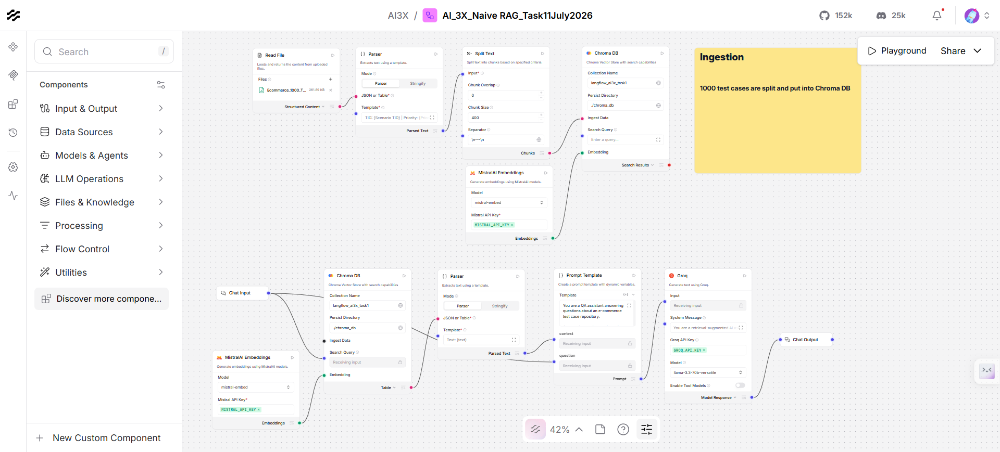
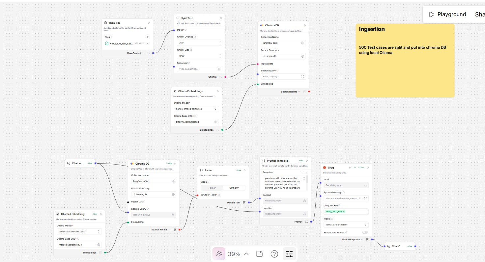
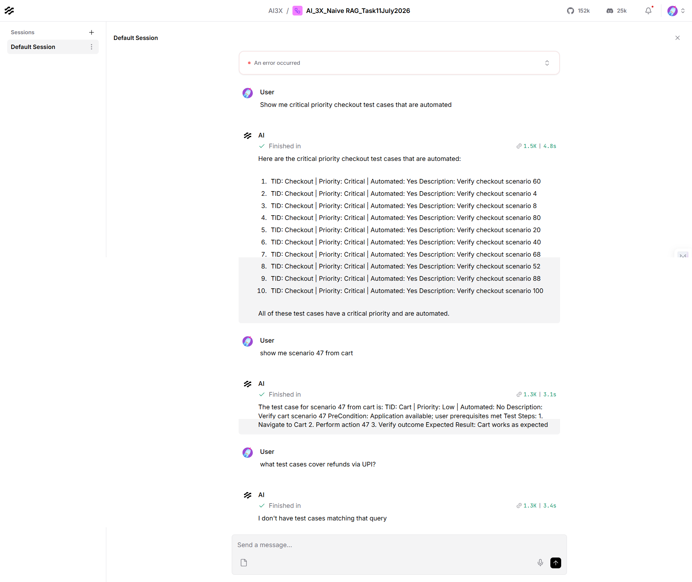
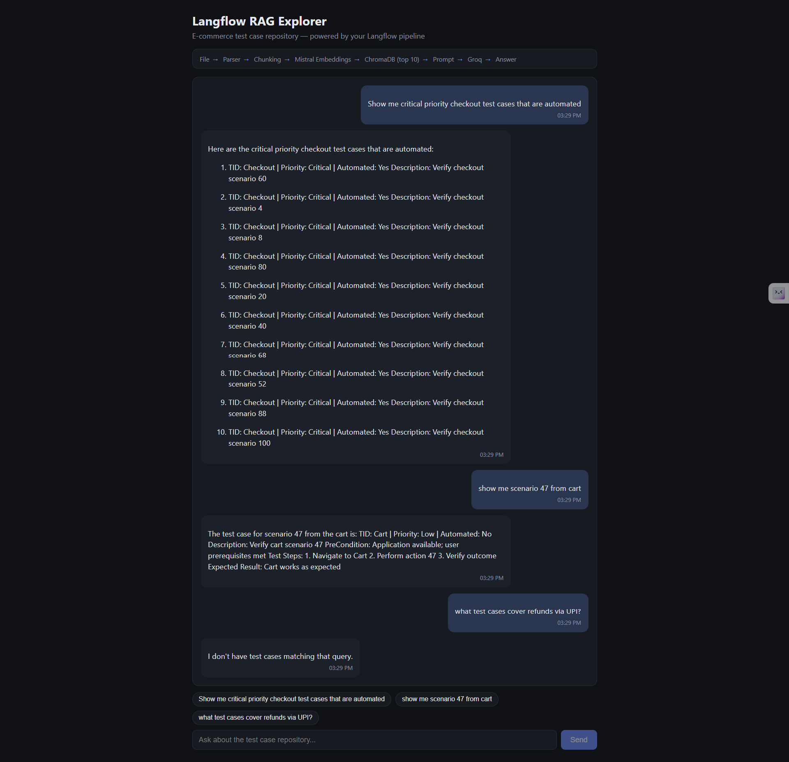

# Chapter 07 — Retrieval-Augmented Generation (RAG)

RAG grounds an LLM's answer in your own documents instead of its training data: split a source
doc into chunks, embed them, store the vectors, retrieve the closest ones for a question, and
hand only those chunks to the model. The output is traceable back to a real passage instead of
being invented.

**Why a QA engineer should care:** this is the same shape as "generate test cases from a PRD" —
except here you can *see* every intermediate step (chunk boundaries, embedding vectors, similarity
scores) instead of trusting a black box. Understanding the pipeline is what lets you debug a RAG
agent that hallucinates or misses obvious answers.

---

## Basic RAG — RAG Explorer

An end-to-end RAG demo with a React UI that visualises every stage of the pipeline:

```
PDF/TXT  →  Chunk  →  Nomic Embed  →  ChromaDB  →  Retrieve top-k  →  Groq answer
```


- **Source docs:** drop `.pdf`/`.txt` files into `Basic_RAG/data/`, or use the **Upload PDF/TXT**
  button in the UI to add them straight from the browser (saved server-side, 20MB cap). Ships with
  two samples — a VWO PRD and a Restful-booker API spec — so **Ingest Docs** ingests every
  supported file in the folder in one pass.
- **Embeddings:** `nomic-embed-text` via local **Ollama** (no API key, runs offline, 768 dims).
- **Vector store:** local **ChromaDB** server, cosine similarity.
- **LLM:** **Groq** `openai/gpt-oss-120b` for the grounded final answer.

The UI shows the real chunks, a slice of an actual embedding vector, the top-k retrieved
passages with similarity scores, and the exact augmented prompt sent to the LLM — nothing is
hidden behind a single "ask a question" box.

**What's here:**
- `Basic_RAG/prompt/prompt.md` — the original build spec used to generate the app.
- `Basic_RAG/data/` — source PDF/TXT files to ingest (also the upload target for the UI button).
- `Basic_RAG/rag-explorer/` — the React + Express app:
  - `server/lib/pdf.js` — extracts text from `.pdf` (via `pdf-parse`) and `.txt` files.
  - `server/lib/chunk.js` — ~1200 char chunks, 200 overlap, breaks on paragraph/sentence boundaries.
  - `server/lib/embed.js` — calls Ollama's `/api/embeddings`.
  - `server/lib/chroma.js` — stores + queries the ChromaDB collection.
  - `server/lib/groq.js` — builds the grounded prompt and calls Groq.
  - `server/index.js` — `/api/upload` (multer, saves into `data/`), `/api/ingest`, `/api/query`, `/api/status`, `/api/reset`.
  - `src/` — the pipeline visualisation UI (Vite + React), including the upload control.

### Prerequisites

1. **Node.js 20+**
2. **Ollama** running locally with the embed model pulled:
   ```bash
   ollama pull nomic-embed-text
   ```
3. **ChromaDB** CLI (Python): `pip install chromadb` — gives you the `chroma` command used by `npm run chroma`.
4. A **Groq API key** → https://console.groq.com/keys

### Run it

```bash
cd chapter_07_RAG/Basic_RAG/rag-explorer
npm install
cp .env.example .env      # paste your GROQ_API_KEY into .env
npm run dev                # starts ChromaDB (:8000) + Express API (:8787) + Vite UI (:5173+)
```

Open the printed Vite URL, optionally **Upload PDF/TXT** your own file, click **Ingest Docs**,
then ask a question. See
`Basic_RAG/rag-explorer/README.md` for the full architecture, config table, and troubleshooting
notes (Windows note: the `chroma` CLI comes from the Python package, not any npm package named
`chroma`/`chromadb` — a stray npm dependency with that name will shadow it on PATH).

---

## LangFlow RAG — RAG Explorer

Same RAG shape as above, but the entire pipeline runs **inside Langflow** (visual, no-code) instead
of hand-rolled Express routes. `LangFlow_RAG/rag-explorer` is a thin React chat UI that calls
Langflow's REST API — it does not re-implement chunking, embedding, retrieval, or prompting itself;
Langflow is the entire RAG backend.

```
File → Parser → Split Text → Mistral Embeddings → ChromaDB (top 10)
     → Prompt Template → Groq llama-3.3-70b-versatile → Chat Output
```



- **Source docs:** `LangFlow_RAG/data/Ecommerce_1000_Test_Cases.csv` and `VWO_500_Test_Cases.csv` —
  loaded into the flow's **File** component and ingested inside Langflow (not by the app).
- **Embeddings:** **Mistral** `mistral-embed` (API key set on the flow's MistralAI Embeddings node).
- **Vector store:** **ChromaDB**, queried for the top-10 most similar chunks per question.
- **LLM:** **Groq** `llama-3.3-70b-versatile` for the grounded final answer.
- **Flow exports** (`LangFlow_RAG/*.json`): four saved variants of the same pipeline captured at
  different build stages — import any one into Langflow (`Flows → Import`) to reproduce the demo.
  `AI_3X_Naive RAG_Task11July2026.json` is the latest (matches the screenshot above). An earlier
  iteration used local **Ollama** embeddings + `llama-3.1-8b-instant` against `VWO_500_Test_Cases.csv`
  before the pipeline moved to Mistral + Groq:

  

### Verified in Langflow's Playground first

Before building a custom UI, the flow's built-in **Playground** confirmed all three demo questions
answer correctly straight out of Langflow — proof the pipeline itself works before any app code
touches it:



### The app: `LangFlow_RAG/rag-explorer`

A thin Vite + React chat UI on top of the verified flow above — same three questions as clickable
suggestion chips, Markdown-rendered answers, and a live proxy straight to Langflow's REST API:



**How it works:**
1. User picks a suggestion chip or types a question.
2. The browser `fetch`es same-origin `POST /api/chat` with
   `{ output_type: "chat", input_type: "chat", input_value, session_id }`.
3. Vite's dev proxy (`vite.config.js`) rewrites that to
   `POST http://localhost:7860/api/v1/run/<flowId>?stream=false` and attaches the `x-api-key`
   header **server-side** — the key is read from `.env` at Vite boot and never appears in a
   browser network call.
4. Langflow runs the flow end-to-end (retrieval + Groq) and returns its response envelope.
5. `src/lib/api.js` defensively extracts `outputs[0].outputs[0].results.message.text`. If that
   path doesn't exist (flow changed, error payload, etc.), the bubble falls back to a collapsible
   **Raw response** block instead of showing blank.
6. A `session_id` (`ui-session-<timestamp>`) is generated once per browser tab via
   `sessionStorage` and reused for every message, so Langflow keeps one chat history thread.

**What's here:**
- `LangFlow_RAG/prompt/prompt-final.md` — the build spec used to generate the `rag-explorer` app
  (REST contract, env vars, error handling, UI requirements).
- `LangFlow_RAG/prompt/prompt.md` — the three demo questions the UI ships as suggestion chips.
- `LangFlow_RAG/*.json` — exported Langflow flows (import into Langflow to rebuild the pipeline).
- `LangFlow_RAG/data/` — the two source CSVs the flow's File component ingests.
- `LangFlow_RAG/rag-explorer/` — the React + Vite chat UI:
  ```
  src/
    main.jsx                    entry point
    App.jsx                     chat state, send/receive, composer
    styles.css                  dark chat theme
    lib/api.js                  session id, fetch, defensive parse, error mapping
    components/
      PipelineBanner.jsx        static "File → ... → Answer" banner
      SuggestionChips.jsx       3 one-click sample questions
      ChatBubble.jsx            markdown answer bubble + raw-JSON fallback
  vite.config.js                 /api/chat proxy + server-side x-api-key injection
  ```

### Prerequisites

1. **Node.js 20+**
2. **Langflow** running locally on `http://localhost:7860` with one of the `LangFlow_RAG/*.json`
   flows imported, its File component pointed at a CSV from `LangFlow_RAG/data/`, and **Ingest**
   already run inside Langflow so ChromaDB is populated.
3. A **Langflow API key**: Langflow UI → gear icon (Settings) → **Langflow API Keys** → create.

### Run it

```bash
cd chapter_07_RAG/LangFlow_RAG/rag-explorer
npm install
cp .env.example .env      # paste your Langflow API key + flow id into .env
npm run dev                # Vite UI, proxies /api/chat to Langflow on :7860
```

Open the printed Vite URL (default `http://localhost:5176`), click a suggestion chip or type a
question.

**Error handling:**

| Condition | Message shown in chat |
|---|---|
| Network error / Langflow not running | "Langflow backend is not reachable. Please make sure Langflow is running on port 7860." |
| `401` / `403` | "Invalid or missing Langflow API key — check your .env file." |
| Other `4xx`/`5xx` | Langflow's own `detail`/`message`, or a generic status line |
| Response shape mismatch | Raw JSON in a collapsible "Raw response" block (never a blank bubble) |

Seen a 401/403? The key is invalid or expired — regenerate it in Langflow's Settings, update
`.env`, then restart `npm run dev` (env vars are only read at server boot, so editing `.env` alone
doesn't take effect until restart). See `LangFlow_RAG/rag-explorer/README.md` for the full env var
table and proxy implementation details.