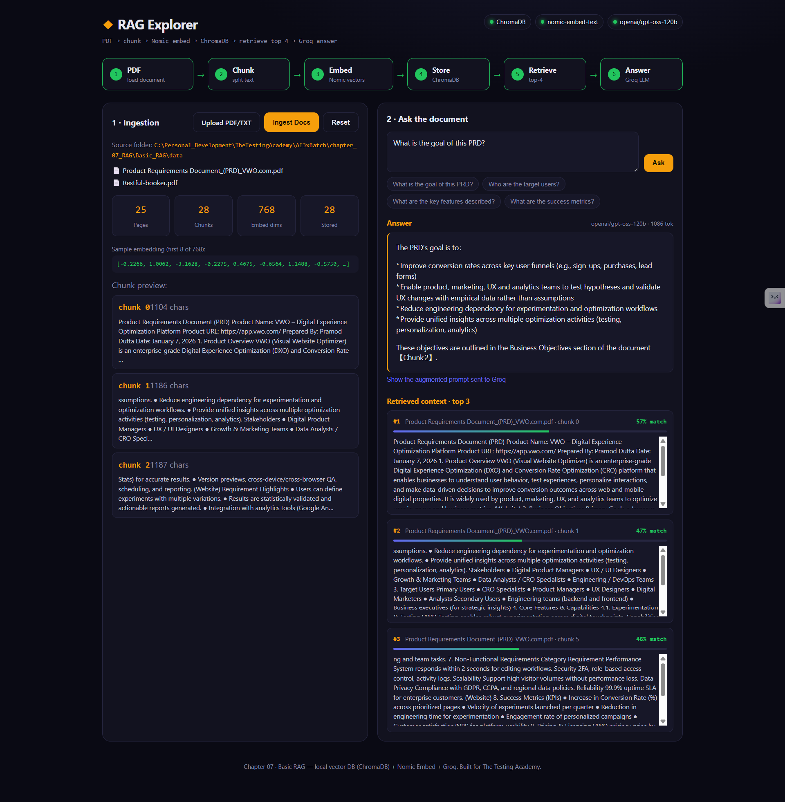

# Chapter 07 — Retrieval-Augmented Generation (RAG)

RAG grounds an LLM's answer in your own documents instead of its training data: split a source
doc into chunks, embed them, store the vectors, retrieve the closest ones for a question, and
hand only those chunks to the model. The output is traceable back to a real passage instead of
being invented.

**Why a QA engineer should care:** this is the same shape as "generate test cases from a PRD" —
except here you can *see* every intermediate step (chunk boundaries, embedding vectors, similarity
scores) instead of trusting a black box. Understanding the pipeline is what lets you debug a RAG
agent that hallucinates or misses obvious answers.

---

## Basic RAG — RAG Explorer

An end-to-end RAG demo with a React UI that visualises every stage of the pipeline:

```
PDF/TXT  →  Chunk  →  Nomic Embed  →  ChromaDB  →  Retrieve top-k  →  Groq answer
```



- **Source docs:** drop `.pdf`/`.txt` files into `Basic_RAG/data/`, or use the **Upload PDF/TXT**
  button in the UI to add them straight from the browser (saved server-side, 20MB cap). Ships with
  two samples — a VWO PRD and a Restful-booker API spec — so **Ingest Docs** ingests every
  supported file in the folder in one pass.
- **Embeddings:** `nomic-embed-text` via local **Ollama** (no API key, runs offline, 768 dims).
- **Vector store:** local **ChromaDB** server, cosine similarity.
- **LLM:** **Groq** `openai/gpt-oss-120b` for the grounded final answer.

The UI shows the real chunks, a slice of an actual embedding vector, the top-k retrieved
passages with similarity scores, and the exact augmented prompt sent to the LLM — nothing is
hidden behind a single "ask a question" box.

**What's here:**
- `Basic_RAG/prompt/prompt.md` — the original build spec used to generate the app.
- `Basic_RAG/data/` — source PDF/TXT files to ingest (also the upload target for the UI button).
- `Basic_RAG/rag-explorer/` — the React + Express app:
  - `server/lib/pdf.js` — extracts text from `.pdf` (via `pdf-parse`) and `.txt` files.
  - `server/lib/chunk.js` — ~1200 char chunks, 200 overlap, breaks on paragraph/sentence boundaries.
  - `server/lib/embed.js` — calls Ollama's `/api/embeddings`.
  - `server/lib/chroma.js` — stores + queries the ChromaDB collection.
  - `server/lib/groq.js` — builds the grounded prompt and calls Groq.
  - `server/index.js` — `/api/upload` (multer, saves into `data/`), `/api/ingest`, `/api/query`, `/api/status`, `/api/reset`.
  - `src/` — the pipeline visualisation UI (Vite + React), including the upload control.

### Prerequisites

1. **Node.js 20+**
2. **Ollama** running locally with the embed model pulled:
   ```bash
   ollama pull nomic-embed-text
   ```
3. **ChromaDB** CLI (Python): `pip install chromadb` — gives you the `chroma` command used by `npm run chroma`.
4. A **Groq API key** → https://console.groq.com/keys

### Run it

```bash
cd chapter_07_RAG/Basic_RAG/rag-explorer
npm install
cp .env.example .env      # paste your GROQ_API_KEY into .env
npm run dev                # starts ChromaDB (:8000) + Express API (:8787) + Vite UI (:5173+)
```

Open the printed Vite URL, optionally **Upload PDF/TXT** your own file, click **Ingest Docs**,
then ask a question. See
`Basic_RAG/rag-explorer/README.md` for the full architecture, config table, and troubleshooting
notes (Windows note: the `chroma` CLI comes from the Python package, not any npm package named
`chroma`/`chromadb` — a stray npm dependency with that name will shadow it on PATH).
