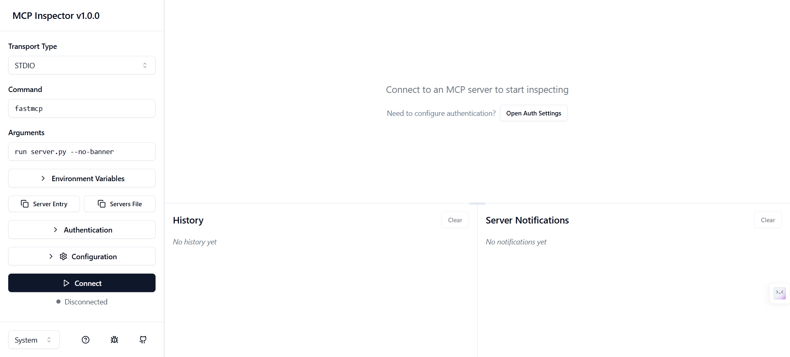
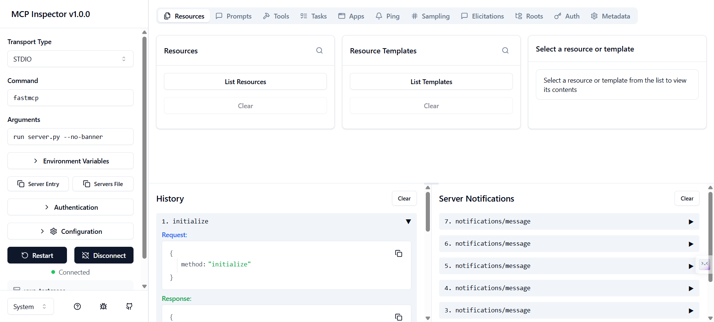
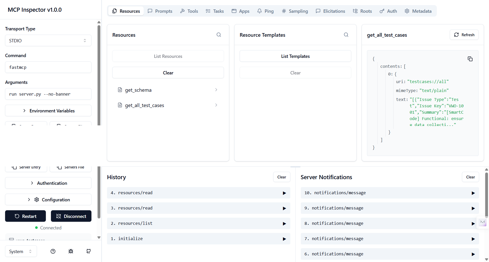
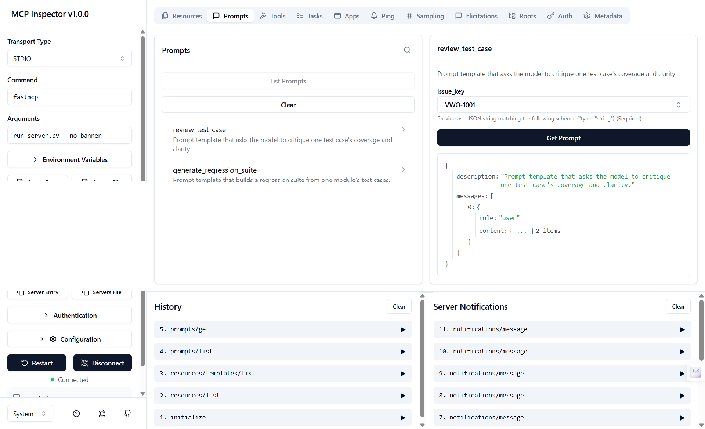
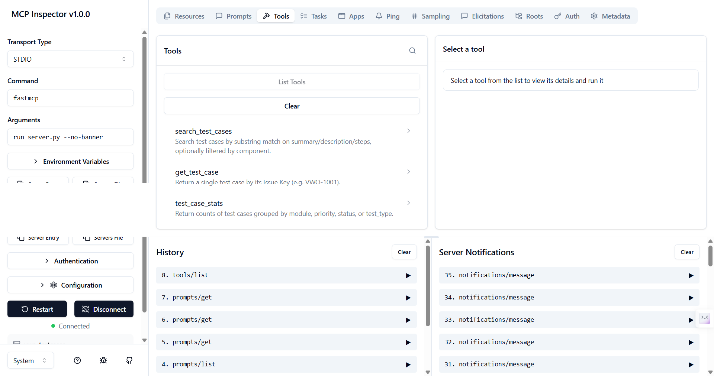
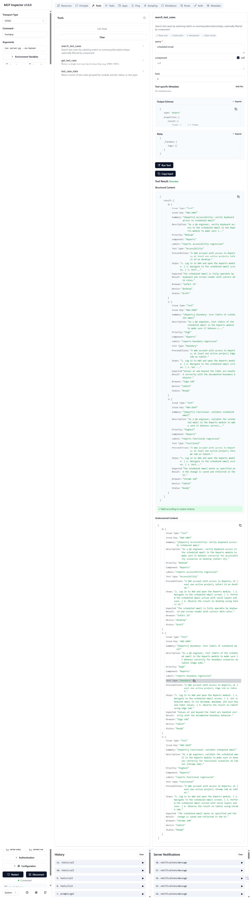
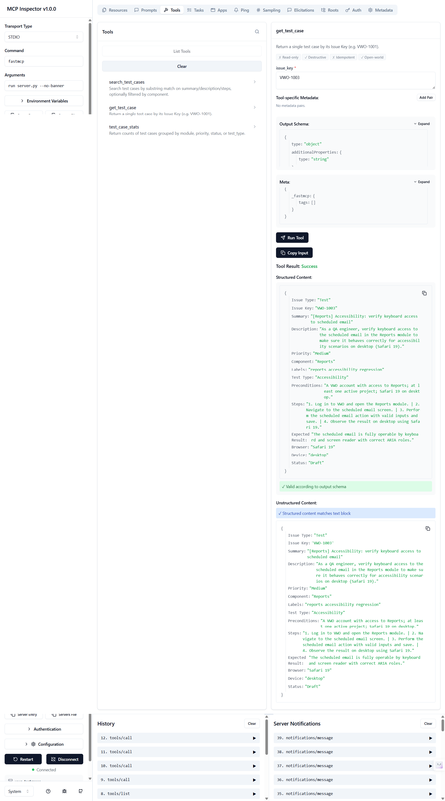
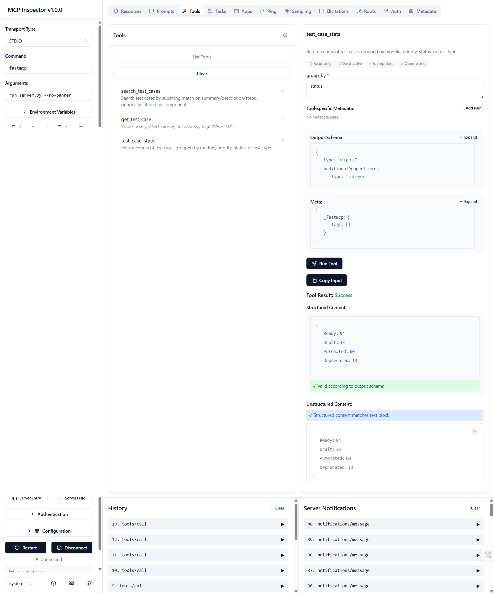
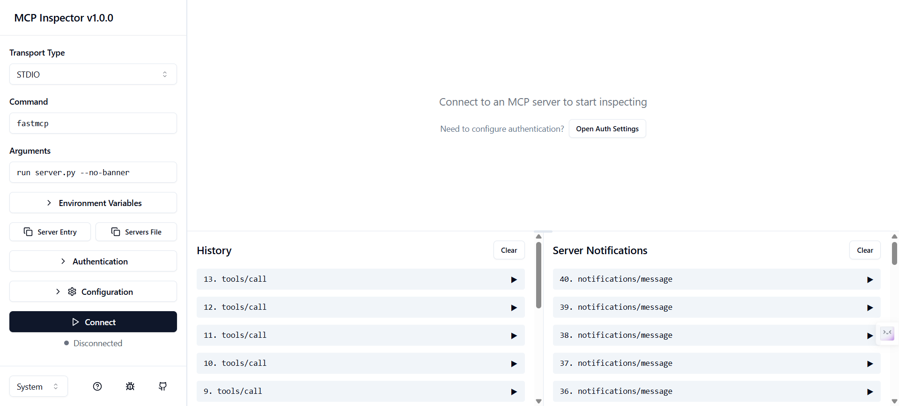

# Chapter 10 — MCP Creation (VIBE)

Local MCP server built with FastMCP over a VWO manual test-case CSV export. Demonstrates
the three MCP primitives — Tools, Resources, Prompts — in one small Python file, verified
live in the MCP Inspector.

- Prompt spec used to generate the server: [Prompt.md](Prompt.md)
- Server project: [testcase-creator-mcp/](testcase-creator-mcp/)
- Source dataset: [resource/vwo_5000_test_cases.csv](resource/vwo_5000_test_cases.csv)

## What the server exposes

**Tools** — `search_test_cases`, `get_test_case`, `test_case_stats`
**Resources** — `testcases://schema`, `testcases://all`, `testcases://module/{name}` (templated)
**Prompts** — `review_test_case`, `generate_regression_suite`

## Run it

```bash
cd testcase-creator-mcp
uv sync
uv run fastmcp dev server.py
```

This opens the MCP Inspector in your browser, connected to the server over stdio.

## Inspector walkthrough (screenshots)

### 1. Inspector on load



Inspector starts disconnected. Transport is `STDIO`, command `fastmcp`, args
`run server.py --no-banner` — this is how `fastmcp dev` wires the Inspector to the local
server process. Click **Connect** to start it.

### 2. Connection established



Status flips to **Connected**. The **History** panel logs the MCP handshake
(`initialize` request/response); **Server Notifications** logs `notifications/message`
entries the server emits on startup (CSV load confirmation via `logging`, sent over stderr
so it never corrupts the stdio JSON-RPC stream).

### 3. Resources list



**Resources** tab → **List Resources** shows the two static resources: `get_schema`
(`testcases://schema`) and `get_all_test_cases` (`testcases://all`). Selecting
`get_all_test_cases` and reading it returns the full 200-row dataset as JSON text content.
The templated resource (`testcases://module/{name}`) appears separately under
**Resource Templates**.

### 4. Prompts with example



**Prompts** tab lists `review_test_case` and `generate_regression_suite`. Filling
`issue_key = VWO-1001` and clicking **Get Prompt** renders the actual message array
(`role: user`, templated critique instructions) that a connected LLM client would receive —
Prompts return conversation content, not raw data.

### 5. Tools list



**Tools** tab lists all three: `search_test_cases`, `get_test_case`, `test_case_stats`,
each with the one-line docstring FastMCP surfaced as the tool description.

### 6. Tools with example — `search_test_cases`



`query = "scheduled email"`, `limit = 3` → returns 3 matching rows (`VWO-1003`, `VWO-1004`,
`VWO-1029`), all from the Reports module. Output passes schema validation
(**✓ Valid according to output schema**).

### 7. Tools with example — `get_test_case`



`issue_key = "VWO-1003"` → returns the single full test case row (Summary, Steps,
Expected Result, Status, etc.), read directly from the in-memory dataset loaded once at
server startup.

### 8. Tools with example — `test_case_stats`



`group_by = "status"` → returns counts: `Ready: 94, Draft: 33, Automated: 60,
Deprecated: 13`.

### 9. Disconnect



Clicking **Disconnect** tears down the Inspector's connection to the server process;
status returns to **Disconnected**, ready to reconnect.

## Register with Claude Desktop

See [testcase-creator-mcp/README.md](testcase-creator-mcp/README.md) for the
`claude_desktop_config.json` snippet and full run/inspect command reference.
